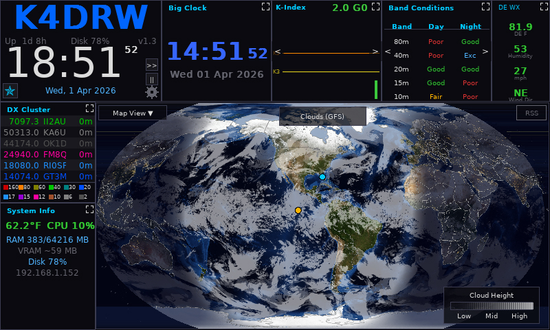

# Setup & Configuration

Most users will never need to edit any files directly — all common settings are available through the **Setup screen** (click the gear icon ⚙ in the Time Panel). This page is a complete reference for every available setting.

**If you do need to edit settings by hand:** HamClock-Next stores its configuration as a plain text file in [JSON format](Glossary.md#json) — think of it as an organized notepad. You can open it with any text editor (Notepad on Windows, TextEdit on Mac, or `nano` / `gedit` on Linux).

File location on your system:
- **Linux / Raspberry Pi:** `~/.config/hamclock-next/config.json`
- **macOS:** `~/Library/Application Support/hamclock-next/config.json`
- **Windows:** `%APPDATA%\hamclock-next\config.json`

On first launch, HamClock-Next creates this file automatically and opens the Setup screen.

---

To access the Setup screen at any time, click the **gear icon (⚙)** in the Time Panel.

---

## Identity

| Field            | Type   | Default | Description                                      |
| ---------------- | ------ | ------- | ------------------------------------------------ |
| `callsign`       | string | `""`    | Your amateur radio callsign                      |
| `grid`           | string | `""`    | Your Maidenhead grid locator (4 or 6 characters) |
| `lat`            | number | `0.0`   | Your latitude in decimal degrees                 |
| `lon`            | number | `0.0`   | Your longitude in decimal degrees                |
| `defaultTzOffset`| int    | `0`     | Default time zone offset in hours from UTC — sets local time for all clocks at once (see note below) |
| `defaultTzLabel` | string | `"UTC"` | Display label for the default time zone (e.g., `"EST"`, `"CET"`)                                    |
| `audioVolume`    | integer| `100`   | Global volume for audio alerts, chimes, and voice notifications (0–100)                             |

**Setting your default time zone**
 changes local time across all tiles that display local time at once — the Aux Clock, Calendar, Big Clock (when not locked to UTC), and World Clock slots. Set it once in Setup → **Identity** instead of configuring each clock widget individually.

If `lat`/`lon` are omitted, they are derived from the center of your grid square.

---

## Appearance & Map

| Field                | Type   | Default             | Description                                                 |
| -------------------- | ------ | ------------------- | ----------------------------------------------------------- |
| `mapStyle`           | string | `"nasa"`            | Map tile style: `nasa`, `terrain`, `countries`              |
| `mapNightLights`     | bool   | `true`              | Show city lights on the nightside of the map                |
| `projection`         | string | `"equirectangular"` | Map projection: `equirectangular`, `robinson`, `azimuthal`, `mercator`, `dual_azimuthal` |
| `showGrid`           | bool   | `false`             | Show grid lines on map                                      |
| `gridType`           | string | `"latlon"`          | Grid type: `latlon` or `maidenhead`                         |
| `showBeacons`        | bool   | `true`              | Show NCDXF/IBP beacon markers on map                        |
| `showSatTrack`       | bool   | `true`              | Show satellite ground track on map                          |
| `theme`              | string | `"default"`         | UI color theme                                              |
| `useMetric`          | bool   | `true`              | Use metric units for weather and distance                   |
| `callsignColor`      | color  | orange              | Display color for your callsign                             |
| `showBorders`        | bool   | `false`             | Show country borders on map                                 |
| `mapCenterLon`       | number | `0.0`               | Center longitude of the map view — set to your home longitude to keep your QTH near the middle of the map in all projections |
| `mapZoom`            | number | `1.0`               | Map zoom level (1.0 = world; up to 10.0)                    |
| `mapPanX`            | number | `0.0`               | Map horizontal pan offset                                   |
| `mapPanY`            | number | `0.0`               | Map vertical pan offset                                     |
| `displayPowerMethod` | string | `"auto"`            | Method to control display (`auto`, `vcgencmd`, `bl_power`)  |
| `showLocalPropGauge` | bool   | `false`             | Show local propagation gauge map overlay                    |
| `showLotwQsos`       | bool   | `true`              | Show/hide ADIF and Logbook of The World (LoTW) world map QSO pins |

---

## Propagation Overlays

| Field            | Type    | Default  | Description                                                                                                           |
| ---------------- | ------- | -------- | --------------------------------------------------------------------------------------------------------------------- |
| `propOverlay`    | string  | `"None"` | Active propagation overlay (`muf`, `voacap`, `reliability`, `toa`, `heatmap`, `drap`, `aurora`)                       |
| `weatherOverlay` | string  | `"none"` | Active weather overlay (`none`, `wxmb`, `clouds_grib`)                                                                |
| `propBand`       | string  | `"20m"`  | Band for propagation modeling                                                                                         |
| `propMode`       | string  | `"SSB"`  | Mode for propagation modeling                                                                                         |
| `propPower`      | integer | `100`    | Power in watts for propagation modeling                                                                               |
| `propToa`        | integer | `3`      | Take-Off Angle for VOACAP overlays (degrees)                                                                          |
| `propPath`       | integer | `0`      | Signal path: `0` = Short Path, `1` = Long Path                                                                        |
| `propAntGain`    | integer | `3`      | Antenna gain in dBi for VOACAP modeling                                                                               |
| `propColormap`   | string  | `"vibrant"` | Propagation overlay color scheme: `muted`, `vibrant`, or `custom`                                                  |
| `mufRtOpacity`   | integer | `40`     | Opacity of MUF real-time overlay (0–100)                                                                              |

---

## Pane Rotation

| Field               | Type    | Default               | Description                                      |
| ------------------- | ------- | --------------------- | ------------------------------------------------ |
| `pane1Rotation`     | array   | `["solar"]`           | Widget rotation list for pane 1                  |
| `pane2Rotation`     | array   | `["dx_cluster"]`      | Widget rotation list for pane 2                  |
| `pane3Rotation`     | array   | `["live_spots"]`      | Widget rotation list for pane 3                  |
| `pane4Rotation`     | array   | `["band_conditions"]` | Widget rotation list for pane 4                  |
| `pane5Rotation`     | array   | `["de_info"]`         | Widget rotation list for pane 5                  |
| `pane6Rotation`     | array   | `["dx_info"]`         | Widget rotation list for pane 6                  |
| `rotationIntervalS` | integer | `30`                  | Seconds each widget is displayed before rotating |
| `syncRotation`      | bool    | `false`               | Advance all panes simultaneously                 |

---

## Panel Mode

| Field                 | Type   | Default | Description                                     |
| --------------------- | ------ | ------- | ----------------------------------------------- |
| `panelMode`           | string | `"dx"`  | Left-column (side panel) mode: `dx` or `sat`    |
| `selectedSatellite`   | string | `""`    | Name of the satellite to track in sat mode      |
| `satWidgetSatellite`  | string | `""`    | Independent satellite for the Sat Widget        |
| `customSatelliteSCCs` | array  | `[]`    | Custom NORAD/SCC numbers for satellite tracking |

---

## DX Cluster

| Field                      | Type    | Default       | Description                                            |
| -------------------------- | ------- | ------------- | ------------------------------------------------------ |
| `dxClusterEnabled`         | bool    | `true`        | Enable DX cluster connection                           |
| `dxClusterHost`            | string  | `"dxusa.net"` | Telnet DX cluster hostname                             |
| `dxClusterPort`            | integer | `7300`        | Telnet DX cluster port                                 |
| `dxClusterLogin`           | string  | `""`          | Login callsign for the cluster                         |
| `dxClusterUseWSJTX`        | bool    | `false`       | Use WSJT-X UDP feed instead of telnet                  |
| `dxClusterHideDuplicates`  | bool    | `true`        | Hide redundant spots for same call/band                |
| `dxClusterMaxAgeMinutes`   | integer | `20`          | Drop spots older than this (allowed: `10`, `20`, `40`, `60`) |
| `wsjtxPort`                | integer | `2237`        | UDP port for WSJT-X feed                               |
| `kIndexAlertThreshold`     | float   | `5.0`         | K-index threshold for alerts and notifications         |

---

## Live Spots

| Field              | Type    | Default                      | Description                                |
| ------------------ | ------- | ---------------------------- | ------------------------------------------ |
| `liveSpotSource`   | string  | `"PSK"`                      | Spot source: `PSK`, `RBN`, or `WSPR`       |
| `liveSpotsOfDe`    | bool    | `true`                       | Show only spots of/by DE callsign          |
| `liveSpotsUseCall` | bool    | `true`                       | Filter by callsign (vs grid)               |
| `liveSpotsMaxAge`  | integer | `30`                         | Maximum spot age in minutes                |
| `liveSpotsBands`   | integer | `0xFFF`                      | Enabled bands (encoded as a bitmask — `0xFFF` means all bands on; most users should leave this alone) |

---

## Big Clock Widget

| Field                | Type    | Default | Description                                    |
| -------------------- | ------- | ------- | ---------------------------------------------- |
| `bigClockDigital`    | bool    | `true`  | Digital mode (vs Analog)                       |
| `bigClock12h`        | bool    | `false` | 12-hour display mode                           |
| `bigClockUtc`        | bool    | `false` | Force UTC display (overrides default TZ)       |
| `bigClockShowSec`    | bool    | `true`  | Show seconds                                   |
| `bigClockShowDate`   | bool    | `true`  | Show current date                              |
| `bigClockHue`        | integer | `85`    | Color hue for clock segments (0–255)           |
| `bigClockUseDefaultTz` | bool  | `false` | Use global default time zone instead of UTC    |

---

## World Clock Widget

| Field         | Type  | Default | Description                                      |
| ------------- | ----- | ------- | ------------------------------------------------ |
| `worldClocks` | array | `[]`    | List of clock objects with `label`, `offsetMinutes`, and `active` status |

---

## Calendar Widget

| Field                      | Type | Default | Description                                             |
| -------------------------- | ---- | ------- | ------------------------------------------------------- |
| `calendarNotifyMinutes`    | int  | `10`    | Minutes before an event to show an alert notification   |
| `calendarAllDayNotifyHour` | int  | `8`     | Hour (UTC) to alert for all-day events                  |
| `calendarDismissMinutes`   | int  | `10`    | Minutes before an alert is automatically dismissed      |

---

## SDO Widget

| Field           | Type   | Default  | Description                                                                                         |
| --------------- | ------ | -------- | --------------------------------------------------------------------------------------------------- |
| `sdoWavelength` | string | `"0193"` | SDO wavelength (e.g., `211193171`, `HMIB`, `0131`, `0193`, `0211`, `0304`, `1600`, `1700`) |
| `sdoRotating`   | bool   | `false`  | Automatically rotate through available wavelengths every 30 seconds                                 |
| `sdoPfss`       | bool   | `false`  | Overlay solar magnetic field lines (PFSS) on supported wavelengths                                  |
| `sdoShowMovie`  | bool   | `false`  | Reserved; movie mode not yet implemented                                                            |

---

## Rotator (Hamlib)

| Field              | Type    | Default | Description                                      |
| ------------------ | ------- | ------- | ------------------------------------------------ |
| `rotatorHost`      | string  | `""`    | Hostname of `rotctld` daemon (empty = disabled)  |
| `rotatorPort`      | integer | `4533`  | Port for `rotctld`                               |
| `rotatorAutoTrack` | bool    | `false` | Automatically point antenna to DX target bearing |
| `rotatorUpover`    | bool    | `false` | Enable flip logic for zenith satellite passes     |

---

## Rig (Hamlib)

| Field         | Type    | Default | Description                                            |
| ------------- | ------- | ------- | ------------------------------------------------------ |
| `rigHost`     | string  | `""`    | Hostname of `rigctld` daemon (empty = disabled)        |
| `rigPort`     | integer | `4532`  | Port for `rigctld`                                     |
| `rigAutoTune` | bool    | `true`  | Automatically set rig frequency to match selected band |

---

## Brightness Schedule

| Field                | Type    | Default | Description                                            |
| -------------------- | ------- | ------- | ------------------------------------------------------ |
| `brightness`         | integer | `100`   | Display brightness (0–100)                             |
| `brightnessSchedule` | bool    | `false` | Enable automatic dim/bright schedule                   |
| `dimHour`            | integer | `22`    | Hour (local) to dim the display                        |
| `dimMinute`          | integer | `0`     | Minute to dim                                          |
| `brightHour`         | integer | `6`     | Hour (local) to restore brightness                     |
| `brightMinute`       | integer | `0`     | Minute to restore                                      |
| `idleMinutes`        | integer | `0`     | Minutes of inactivity before screen blank (0=disabled) |

---

## Marine Widget

| Field               | Type   | Default | Description                                      |
| ------------------- | ------ | ------- | ------------------------------------------------ |
| `marineStation`     | string | `""`    | NOAA Tide Station ID                             |
| `marineBuoy`        | string | `""`    | NOAA Buoy ID                                     |
| `marineStationName` | string | `""`    | (Info) Readable name of the tide station         |

---

## Alarms

HamClock-Next has two alarm types: a **daily repeating alarm** and a **one-time alarm**. Both play an audio alert at the set time.

Configure alarms in Setup → **Timers** tab, or by editing the fields below directly.

| Field            | Type    | Default | Description                                 |
| ---------------- | ------- | ------- | ------------------------------------------- |
| `alarmArmed`     | bool    | `false` | Enable daily alarm                          |
| `alarmTimeHH`    | integer | `7`     | Alarm hour (0-23)                           |
| `alarmTimeMM`    | integer | `0`     | Alarm minute                                |
| `alarmUtc`       | bool    | `true`  | Alarm time is in UTC (vs local)             |
| `onceAlarmArmed` | bool    | `false` | Enable one-time alarm                       |
| `onceAlarmTime`  | string  | `""`    | One-time alarm date (seconds since epoch)   |

**Tip:** Set `alarmUtc` to `false` if you want the alarm to fire at local time (e.g., 07:00 your morning) rather than UTC.

---

## Aux Clock

| Field              | Type   | Default | Description                                                                                                                                |
| ------------------ | ------ | ------- | ------------------------------------------------------------------------------------------------------------------------------------------ |
| `auxClockTzOffset` | int    | `0`     | Hours offset from UTC (-12 to +14).                                                                                                        |
| `auxClockTzLabel`  | string | `"UTC"` | Display label shown in the widget title.                                                                                                   |
| `auxClockStarMode` | int    | `0`     | Sidereal mode index for the Aux Clock.                                                                                                   |

---

## Updates & Migration

### Automatic Updates

HamClock-Next can check for and download updates automatically. When a new version is available, you'll see a notification in the app.

| Field            | Type   | Default | Description                                                 |
| ---------------- | ------ | ------- | ----------------------------------------------------------- |
| `skippedVersion` | string | `""`    | Version string to skip the update reminder                  |

To check for updates manually, go to the Settings → Updates tab in the app.

### EEPROM Migration

When upgrading from an older HamClock installation (original HamClock), your settings are automatically carried forward:

- **Original HamClock** — settings stored in EEPROM are detected and migrated to the JSON format

---

## Local Data Hub (LAN sharing)

If you run more than one HamClock-Next instance on the same local network, one of them can fetch data from the internet and share it with the others. The sharing instance is the **Master**; the rest are **Clients**. The benefits are lower internet traffic and a lighter load on the public data services.

You only need this if you have two or more copies running — for a single HamClock-Next, leave it off.

| Field     | Type    | Default | Description                                                                                       |
| --------- | ------- | ------- | ------------------------------------------------------------------------------------------------- |
| `hubMode` | string  | `"off"` | Role of this instance. `"off"` = normal, `"master"` = share data with others, `"client"` = fetch from a Master |
| `hubIp`   | string  | `""`    | (Client only) Hostname or IP address of the Master instance                                       |
| `hubPort` | integer | `8080`  | (Client only) HTTP port the Master is listening on                                                |

**Typical setup:**
1. On the machine that has the most reliable internet connection, set `hubMode` to `"master"`.
2. On every other HamClock-Next on your network, set `hubMode` to `"client"` and fill in `hubIp` (and `hubPort` if the Master is on a non-default port).
3. Save and restart each instance.

If a Client cannot reach the Master, it falls back to fetching from the internet directly — so a Master going offline does not break the other clocks.

---

## Custom Settings

| Field            | Type   | Default | Description                                                 |
| ---------------- | ------ | ------- | ----------------------------------------------------------- |
| `colorOverrides` | object | `{}`    | Per-element color overrides (advanced)                      |
| `watchlist`      | array  | `[]`    | List of callsigns to monitor. In the setup screen, you can paste a list of callsigns separated by commas or spaces to add them all at once. |
| `ontaFilter`     | string | `"all"` | Filter activations: `all`, `pota`, or `sota`                |
| `corsProxyUrl`   | string | `"/proxy/"` | CORS proxy URL prefix for browser builds                |
| `deletedFactoryPresets` | array | `[]` | Names of factory presets deleted by the user              |

---

## Service API Keys

These keys enable advanced integrations with external services. Configure these in Setup → **Services** tab.

| Field          | Type   | Default | Description                                   |
| -------------- | ------ | ------- | --------------------------------------------- |
| `repeaterbook` | string | `""`    | RepeaterBook API key                          |
| `winlink`      | string | `""`    | Winlink API key / password                    |
| `lotw_call`    | string | `""`    | ARRL Logbook of The World (LoTW) callsign     |
| `lotw_password`| string | `""`    | LoTW password                                 |
| `clublog`      | string | `""`    | Clublog API key                               |
