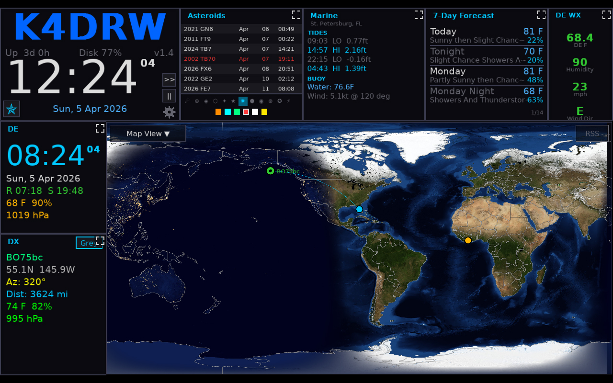

# Setup & Configuration

All configuration is stored as JSON. On first launch, HamClock-Next creates a default configuration file and opens the Setup screen. You can also edit the JSON file directly.

To access the Setup screen, click the **gear icon (⚙)** in the Time Panel.

<!-- TODO: screenshot needed -->

---

## Identity

| Field      | Type   | Default | Description                                      |
| ---------- | ------ | ------- | ------------------------------------------------ |
| `callsign` | string | `""`    | Your amateur radio callsign                      |
| `grid`     | string | `""`    | Your Maidenhead grid locator (4 or 6 characters) |
| `lat`      | number | `0.0`   | Your latitude in decimal degrees                 |
| `lon`      | number | `0.0`   | Your longitude in decimal degrees                |

If `lat`/`lon` are omitted, they are derived from the center of your grid square.

---

## Appearance & Map

| Field            | Type   | Default             | Description                                                 |
| ---------------- | ------ | ------------------- | ----------------------------------------------------------- |
| `mapStyle`       | string | `"nasa"`            | Map tile style: `nasa`, `terrain`, `countries`              |
| `mapNightLights` | bool   | `true`              | Show city lights on the nightside of the map                |
| `projection`     | string | `"equirectangular"` | Map projection: `equirectangular` (Mercator) or `azimuthal` |
| `showGrid`       | bool   | `false`             | Show grid lines on map                                      |
| `gridType`       | string | `"latlon"`          | Grid type: `latlon` or `maidenhead`                         |
| `showBeacons`    | bool   | `true`              | Show NCDXF/IBP beacon markers on map                        |
| `showSatTrack`   | bool   | `true`              | Show satellite ground track on map                          |
| `theme`          | string | `"default"`         | UI color theme                                              |
| `useMetric`      | bool   | `true`              | Use metric units for weather and distance                   |
| `callsignColor`  | color  | orange              | Display color for your callsign                             |
| `showBorders`    | bool   | `false`             | Show country borders on map                                 |
| `mapCenterLon`   | number | `0.0`               | Center longitude of the map view                            |
| `mapZoom`        | number | `1.0`               | Map zoom level (1.0 = full world)                           |
| `displayPowerMethod` | string | `"auto"`        | Method to control display (`auto`, `vcgencmd`, `bl_power`) |

---

## Propagation Overlays

| Field            | Type    | Default  | Description                                                                                                           |
| ---------------- | ------- | -------- | --------------------------------------------------------------------------------------------------------------------- |
| `propOverlay`    | string  | `"None"` | Active propagation overlay (`None`, `MUF_RT`, `VOACAP_AREA`, `VOACAP_POINT`, `RELIABILITY`, `TOA`, `HEATMAP`, `DRAP`) |
| `weatherOverlay` | string  | `"none"` | Active weather overlay (`none`, `wxmb`, `clouds_grib`)                                                                |
| `propBand`       | string  | `"20m"`  | Band for propagation modeling                                                                                         |
| `propMode`       | string  | `"SSB"`  | Mode for propagation modeling                                                                                         |
| `propPower`      | integer | `100`    | Power in watts for propagation modeling                                                                               |
| `mufRtOpacity`   | integer | `40`     | Opacity of MUF real-time overlay (0–100)                                                                              |

---

## Pane Rotation

| Field               | Type    | Default               | Description                                      |
| ------------------- | ------- | --------------------- | ------------------------------------------------ |
| `pane1Rotation`     | array   | `["SOLAR"]`           | Widget rotation list for pane 1                  |
| `pane2Rotation`     | array   | `["DX_CLUSTER"]`      | Widget rotation list for pane 2                  |
| `pane3Rotation`     | array   | `["LIVE_SPOTS"]`      | Widget rotation list for pane 3                  |
| `pane4Rotation`     | array   | `["BAND_CONDITIONS"]` | Widget rotation list for pane 4                  |
| `pane5Rotation`     | array   | `["DE_INFO"]`         | Widget rotation list for pane 5                  |
| `pane6Rotation`     | array   | `["DX_INFO"]`         | Widget rotation list for pane 6                  |
| `rotationIntervalS` | integer | `30`                  | Seconds each widget is displayed before rotating |
| `syncRotation`      | bool    | `false`               | Advance all panes simultaneously                 |

---

## Panel Mode

| Field                 | Type   | Default | Description                                     |
| --------------------- | ------ | ------- | ----------------------------------------------- |
| `panelMode`           | string | `"dx"`  | Right-column panel mode: `dx` or `sat`          |
| `selectedSatellite`   | string | `""`    | Name of the satellite to track in sat mode      |
| `customSatelliteSCCs` | array  | `[]`    | Custom NORAD/SCC numbers for satellite tracking |

---

## DX Cluster

| Field               | Type    | Default       | Description                                            |
| ------------------- | ------- | ------------- | ------------------------------------------------------ |
| `dxClusterEnabled`  | bool    | `true`        | Enable DX cluster connection                           |
| `dxClusterHost`     | string  | `"dxusa.net"` | Telnet DX cluster hostname                             |
| `dxClusterPort`     | integer | `7300`        | Telnet DX cluster port                                 |
| `dxClusterLogin`    | string  | `""`          | Login callsign for the cluster (usually your callsign) |
| `dxClusterUseWSJTX` | bool    | `false`       | Use WSJT-X UDP feed instead of telnet                  |
| `wsjtxPort`         | integer | `2237`        | UDP port for WSJT-X feed                               |

---

## Live Spots

| Field              | Type    | Default                      | Description                                |
| ------------------ | ------- | ---------------------------- | ------------------------------------------ |
| `liveSpotSource`   | string  | `"PSK"`                      | Spot source: `PSK` (PSK Reporter) or `RBN` |
| `liveSpotsOfDe`    | bool    | `true`                       | Show only spots of/by DE callsign          |
| `liveSpotsUseCall` | bool    | `true`                       | Filter by callsign (vs grid)               |
| `liveSpotsMaxAge`  | integer | `30`                         | Maximum spot age in minutes                |
| `liveSpotsBands`   | integer | `0xFFF`                      | Bitmask of enabled bands                   |
| `rbnEnabled`       | bool    | `false`                      | Enable Reverse Beacon Network (legacy)     |
| `rbnHost`          | string  | `"telnet.reversebeacon.net"` | RBN telnet host                            |
| `rbnPort`          | integer | `7000`                       | RBN telnet port                            |

---

## SDO Widget

| Field           | Type   | Default  | Description                                                                                              |
| --------------- | ------ | -------- | -------------------------------------------------------------------------------------------------------- |
| `sdoWavelength` | string | `"0193"` | SDO wavelength (e.g., `211193171`, `HMIB`, `HMIIC`, `0131`, `0193`, `0211`, `0304`, `1600`, `1700`)      |
| `sdoRotating`   | bool   | `false`  | Automatically rotate through available wavelengths every 30 seconds                                      |
| `sdoPfss`       | bool   | `false`  | Overlay solar magnetic field lines (PFSS) on supported wavelengths                                       |
| `sdoShowMovie`  | bool   | `false`  | Show SDO image as a time-lapse movie loop (currently inactive)                                           |

---

## Rotator (Hamlib)

| Field              | Type    | Default | Description                                      |
| ------------------ | ------- | ------- | ------------------------------------------------ |
| `rotatorHost`      | string  | `""`    | Hostname of `rotctld` daemon (empty = disabled)  |
| `rotatorPort`      | integer | `4533`  | Port for `rotctld`                               |
| `rotatorAutoTrack` | bool    | `false` | Automatically point antenna to DX target bearing |

---

## Rig (Hamlib)

| Field         | Type    | Default | Description                                            |
| ------------- | ------- | ------- | ------------------------------------------------------ |
| `rigHost`     | string  | `""`    | Hostname of `rigctld` daemon (empty = disabled)        |
| `rigPort`     | integer | `4532`  | Port for `rigctld`                                     |
| `rigAutoTune` | bool    | `true`  | Automatically set rig frequency to match selected band |

---

## QRZ Callbook

| Field         | Type   | Default | Description      |
| ------------- | ------ | ------- | ---------------- |
| `qrzUsername` | string | `""`    | QRZ.com username |
| `qrzPassword` | string | `""`    | QRZ.com password |

---

## Brightness Schedule

| Field                | Type    | Default | Description                          |
| -------------------- | ------- | ------- | ------------------------------------ |
| `brightness`         | integer | `100`   | Display brightness (0–100)           |
| `brightnessSchedule` | bool    | `false` | Enable automatic dim/bright schedule |
| `dimHour`            | integer | `22`    | Hour (local) to dim the display      |
| `dimMinute`          | integer | `0`     | Minute to dim                        |
| `brightHour`         | integer | `6`     | Hour (local) to restore brightness   |
| `brightMinute`       | integer | `0`     | Minute to restore                    |
| `idleMinutes`         | integer | `0`     | Minutes of inactivity before screen blank (0=disabled) |

---

## Alarms

| Field                | Type    | Default | Description                                 |
| -------------------- | ------- | ------- | ------------------------------------------- |
| `alarmArmed`         | bool    | `false` | Enable daily alarm                          |
| `alarmTimeHH`        | integer | `7`     | Alarm hour (0-23)                           |
| `alarmTimeMM`        | integer | `0`     | Alarm minute                                |
| `alarmUtc`           | bool    | `true`  | Alarm time is in UTC (vs local)             |
| `onceAlarmArmed`     | bool    | `false` | Enable one-time alarm                       |
| `onceAlarmTime`      | string  | `""`    | One-time alarm date (ISO: YYYY-MM-DDTHH:MM) |

---

## Aux Clock

| Field              | Type   | Default | Description                                                                                                     |
| ------------------ | ------ | ------- | --------------------------------------------------------------------------------------------------------------- |
| `auxClockTzOffset` | int    | `0`     | Hours offset from UTC (-12 to +14). Controlled by clicking the widget or via `/set_config?aux_tz_offset={n}`   |
| `auxClockTzLabel`  | string | `"UTC"` | Display label shown in the widget title. Set via `/set_config?aux_tz_label={label}`. Preset cycle: UTC, EST, CST, MST, PST, CET, JST, AEST |

**API control**: `GET /set_config?aux_tz_offset=-5&aux_tz_label=EST`

---

## Countdown / Reminder

| Field            | Type   | Default | Description                               |
| ---------------- | ------ | ------- | ----------------------------------------- |
| `countdownLabel` | string | `""`    | Label for the countdown widget event      |
| `countdownTime`  | string | `""`    | Target date/time for the countdown        |
| `callsignExpiry` | string | `""`    | License expiry date string                |
| `callsignFrn`    | string | `""`    | FCC FRN for license lookup                |
| `reminders`      | array  | `[]`    | List of reminder entries (date + message) |

---

## Watchlist

| Field       | Type  | Default | Description                                           |
| ----------- | ----- | ------- | ----------------------------------------------------- |
| `watchlist` | array | `[]`    | List of callsigns to monitor in the DX cluster stream |

---

## On The Air (POTA/SOTA)

| Field        | Type   | Default | Description                                  |
| ------------ | ------ | ------- | -------------------------------------------- |
| `ontaFilter` | string | `"all"` | Filter activations: `all`, `pota`, or `sota` |

---

## Hub Mode (Local Data Server)

| Field     | Type    | Default | Description                                       |
| --------- | ------- | ------- | ------------------------------------------------- |
| `hubMode` | string  | `"Off"` | Local data hub mode: `Off`, `Server`, or `Client` |
| `hubIp`   | string  | `""`    | Hub server IP address (client mode)               |
| `hubPort` | integer | `8080`  | Hub server port                                   |

---

## Network (WASM / Browser)

| Field          | Type   | Default     | Description                                                  |
| -------------- | ------ | ----------- | ------------------------------------------------------------ |
| `corsProxyUrl` | string | `"/proxy/"` | CORS proxy URL prefix for browser builds (usually `/proxy/`) |

---

## Misc

| Field            | Type   | Default | Description                                                 |
| ---------------- | ------ | ------- | ----------------------------------------------------------- |
| `preventSleep`   | bool   | `true`  | Prevent the OS from sleeping while HamClock-Next is running |
| `gpsEnabled`     | bool   | `false` | Use GPS for location                                        |
| `rssEnabled`     | bool   | `true`  | Enable RSS ticker (if present)                              |
| `asteroidIcon`   | string | `"☄"`   | Icon character shown in the Asteroid widget                 |
| `asteroidColor`  | color  | orange  | Display color for the asteroid icon                         |
| `colorOverrides` | object | `{}`    | Per-element color overrides (advanced)                      |
| `skippedVersion` | string | `""`    | Version string to suppress update nag                       |
| `rotatorUpover`  | bool   | `false` | Enable "up and over" flip logic for zenith passes           |
