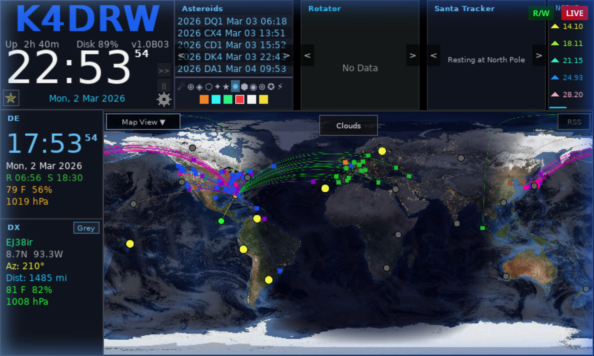

# HamClock-Next

HamClock-Next is an open-source amateur radio dashboard that displays real-time space weather, propagation data, DX cluster spots, maps, and dozens of other widgets useful to the ham radio operator.

It is a community continuation of the original HamClock created by Elwood Downey, WB0OEW (Silent Key, 29 January 2026), modernized with a SDL2-based rendering engine, a six-pane rotatable widget layout, and full browser support via WebAssembly.

---

## Key Features

- **44 widgets** covering space weather, propagation, DX spots, maps, weather, tracking, and utilities
- **Six rotatable panes** — each pane cycles through any list of widgets on a configurable interval
- **Map overlays** — MUF, VOACAP, cloud cover, aurora, and more drawn live on the world map
- **Presets** — save and recall complete dashboard configurations with one click
- **Runs everywhere** — native Linux/macOS/Windows framebuffer and browser (WASM) builds
- **K key** — highlight every interactive region on screen with a tooltip

---

## Quick Links

- [Getting Started](Getting-Started.md) — build, install, first launch
- [Screen Layout](Layout.md) — what each region of the screen does
- [Widgets Reference](Widgets.md) — all 44 widgets described
- [Map & Overlays](Map-and-Overlays.md) — map projections and overlay layers
- [Pane Customization](Pane-Customization.md) — configure pane widget rotations
- [Configuration Presets](Presets.md) — save and recall configurations
- [Setup & Configuration](Configuration.md) — all settings fields
- [Data Sources & Network](Data-Sources.md) — what HamClock-Next fetches and from where
- [Keyboard Shortcuts](Keyboard-Shortcuts.md) — K, Ctrl+Q, and in-dialog shortcuts
- [Migrating from Original HamClock](Migrating-from-HamClock.md) — what changed

---

## In Memoriam

HamClock-Next carries forward the work of **Elwood Downey, WB0OEW**, the original author of HamClock, who became a Silent Key on 29 January 2026. His tireless contribution to the amateur radio community lives on in every running instance.

73 de WB0OEW
