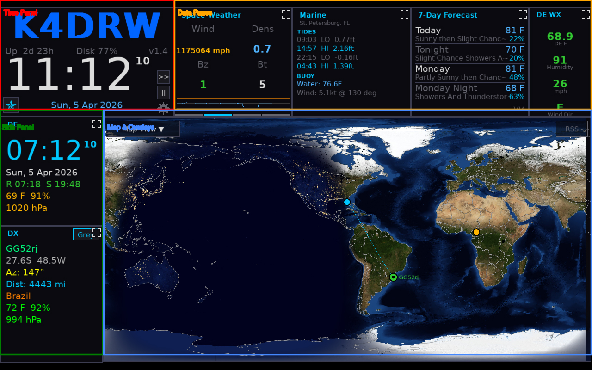

# Screen Layout

HamClock-Next divides the screen into a few fixed areas. Understanding the layout is the first step to customizing your dashboard.



---

## Regions at a Glance

HamClock-Next uses a top bar and a left-side panel to leave as much room as possible for the map.

```
+----------+----------+----------+----------+-------+
| Time     | Pane 1   | Pane 2   | Pane 3   | Pane4 |
| Panel    | (rot)    | (rot)    | (rot)    | (stat)|
+----------+----------+----------+----------+-------+
|          |                                        |
| Pane 5   |                                        |
| (rot)    |                                        |
|          |             MAP AREA                   |
+----------+             (center)                   |
|          |                                        |
| Pane 6   |                                        |
| (rot)    |                                        |
|          |        RSS Ticker (optional)           |
+---------------------------------------------------+
```

> **Note on Pane 4**: This is a narrow status pane, usually used for the NCDXF Beacon widget or simple status information.

> Layout proportions vary by screen size and panel mode. The exact arrangement is chosen when the app starts.

---

## Time Panel

The Time Panel occupies the top-left corner and is **not** a rotatable pane — it always displays the same content.


Contents:

| Element              | Description                                  |
| -------------------- | -------------------------------------------- |
| **UTC clock**        | Current UTC time, large digits               |
| **Local clock**      | Local time based on your configured time zone |
| **DE callsign**      | Your callsign as entered in Setup            |
| **DE grid**          | Your [Maidenhead grid locator](Glossary.md#maidenhead-grid-square) |
| **Sunrise / Sunset** | Today's sunrise and sunset times for your location |
| **Gear icon (⚙)**    | Opens the Setup modal                        |
| **Star icon (★)**    | Opens the [Presets modal](Presets.md)        |

---

## The Six Panes

Panes 1-6 are widget areas that can cycle through a list of widgets.

- **Click the top strip** of any pane to open the widget picker
- **Rotation** advances automatically on a configurable timer, usually every 30 seconds
- Panes can be set to rotate together if you want them synchronized

See [Pane Customization](Pane-Customization.md) for details.

---

## Map

The large center area displays the world map. It supports:

- **Mercator** and **Azimuthal** projections
- Propagation overlays (MUF, VOACAP, DRAP, and more)
- Weather overlays (cloud cover, surface pressure)
- Night shadow (gray line)
- Grid lines (latitude/longitude or Maidenhead)
- Beacon markers (NCDXF/IBP)
- Satellite ground tracks

See [Map & Overlays](Map-and-Overlays.md) for details.

---

In **side panel mode**, the left column (Panes 5 and 6) is replaced by a tall panel showing either:

- **DX Info** — information about your current DX entity target
- **Satellite** — ground track and pass information for a tracked satellite

The panel mode is controlled by the `panelMode` setting.

---

## Interactive Regions and the K Key

Pressing **K** turns on highlight mode. All interactive screen regions light up with cyan boxes and a tooltip label.


This is the fastest way to discover clickable controls, especially on unfamiliar widgets.
