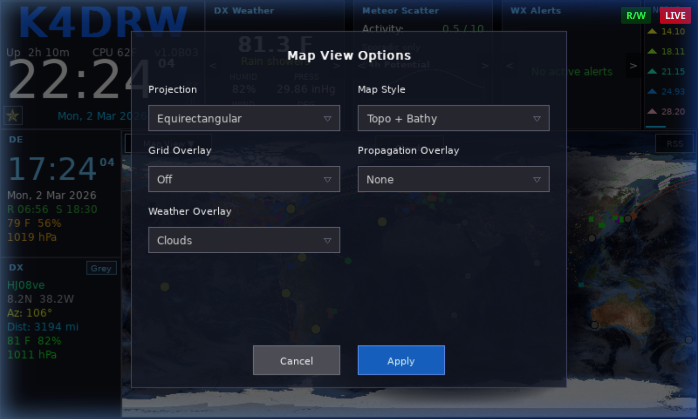
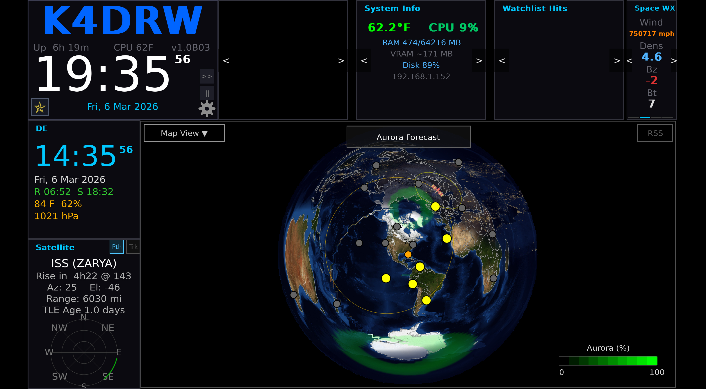
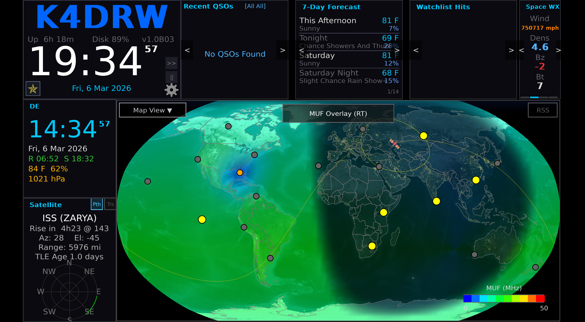
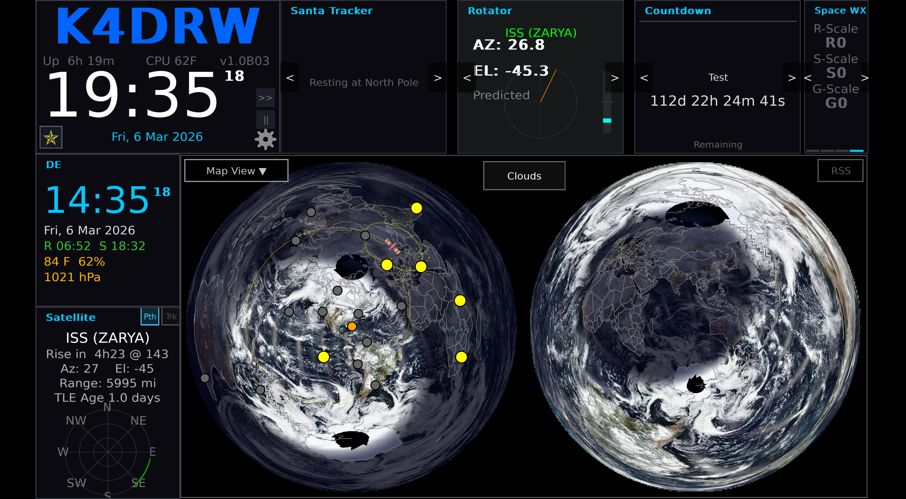

# Map & Overlays

The large center area of HamClock-Next displays an interactive world map with configurable projections and overlay layers. Map options are controlled via the **Map View Options** modal.

---

## Map Projections

HamClock-Next supports five map projections, selectable from the Setup or map controls:

### Equirectangular

The default projection. Shows the full world with longitude and latitude as straight lines. Easy to read and works well for most purposes.

### Robinson

A compromise projection that balances distortion of area, shape, distance, and direction. Gives a visually pleasing view of the whole world.

### Azimuthal (Great Circle) *(new in HamClock-Next)*

Centered on your DE location. Shows true bearing and distance in all directions as straight lines from your QTH. Useful for antenna pointing. The original HamClock only offered the dual-hemisphere variant; this single-circle view is a HamClock-Next addition.

### Mercator

A cylindrical projection that preserves angles and shapes locally. Useful for navigation but significantly distorts area near the poles.

### Dual Azimuthal

Displays two side-by-side azimuthal equidistant circles: the left centered on DE and the right centered on the antipodal point. Together they show the complete globe — every location on Earth appears in one of the two circles with no clipping. Great-circle paths remain straight within each hemisphere.

---

## Map Styles

The base map tile style can be changed in [Setup & Configuration](Configuration.md):

| Style       | Description                                   |
| ----------- | --------------------------------------------- |
| `nasa`      | NASA Blue Marble imagery (default)            |
| `terrain`   | Topographic terrain shading                   |
| `countries` | Political country boundaries with fill colors |

---

## Night Shadow (Gray Line)

The night/day terminator (gray line) is always shown on the map, shading the nightside of Earth. This is computed from the current UTC time and astronomical formulas.

---

## Grid Lines

Two grid line types are available (toggle in Configuration):

| Type         | Description                       |
| ------------ | --------------------------------- |
| `latlon`     | Standard latitude/longitude lines |
| `maidenhead` | Maidenhead grid square boundaries |

---

## Propagation Overlays

Propagation overlays shade the map to show HF radio propagation conditions. Only one overlay is active at a time.

Select the active overlay and configure band/mode/power from the Configuration screen or via the map overlay controls.

| Overlay             | Description                                                                                                                |
| ------------------- | -------------------------------------------------------------------------------------------------------------------------- |
| **None**            | No propagation overlay                                                                                                     |
| **MUF (Real-time)** | Maximum Usable Frequency derived from real-time NOAA ionospheric data — shows areas where the selected band is likely open |
| **VOACAP Area**     | VOACAP-based propagation reliability prediction from DE to all areas of the map on the selected band                       |
| **VOACAP Point**    | VOACAP prediction from DE to a specific DX target point                                                                    |
| **Reliability**     | Circuit reliability percentage map                                                                                         |
| **TOA**             | Take-Off Angle prediction                                                                                                  |
| **Heatmap**         | Live spot density heat map from PSK Reporter data                                                                          |
| **DRAP**            | D-Region Absorption Prediction (also available as a widget)                                                                |

<!-- TODO: screenshot needed -->

### Propagation Settings

Configure these fields in [Setup & Configuration](Configuration.md):

| Field          | Description                                       |
| -------------- | ------------------------------------------------- |
| `propBand`     | Amateur band to model (e.g., `20m`, `40m`, `10m`) |
| `propMode`     | Emission mode (`SSB`, `CW`, `FT8`, etc.)          |
| `propPower`    | Transmitter power in watts                        |
| `mufRtOpacity` | Opacity of the MUF real-time overlay (0–100)      |

---

## Weather Overlays

Weather overlays can be displayed independently of propagation overlays.

| Overlay    | Description                               |
| ---------- | ----------------------------------------- |
| **None**   | No weather overlay                        |
| **Clouds** | Global cloud cover from satellite imagery |
| **WxMb**   | Surface pressure / weather map contours   |

---

## Beacon Markers

When enabled (`showBeacons: true`), the NCDXF/IBP international beacon network transmitter sites are shown as markers on the map. The currently transmitting beacon is highlighted.

---

## Satellite Ground Tracks

When a satellite is selected and tracking is enabled (`showSatTrack: true`), the satellite's ground track is drawn on the map as an arc showing the upcoming orbital path.

---

## Night Lights

When `mapNightLights` is enabled (default: on), the nightside of the map shows city light imagery from NASA's night lights dataset, overlaid with the night shadow.
