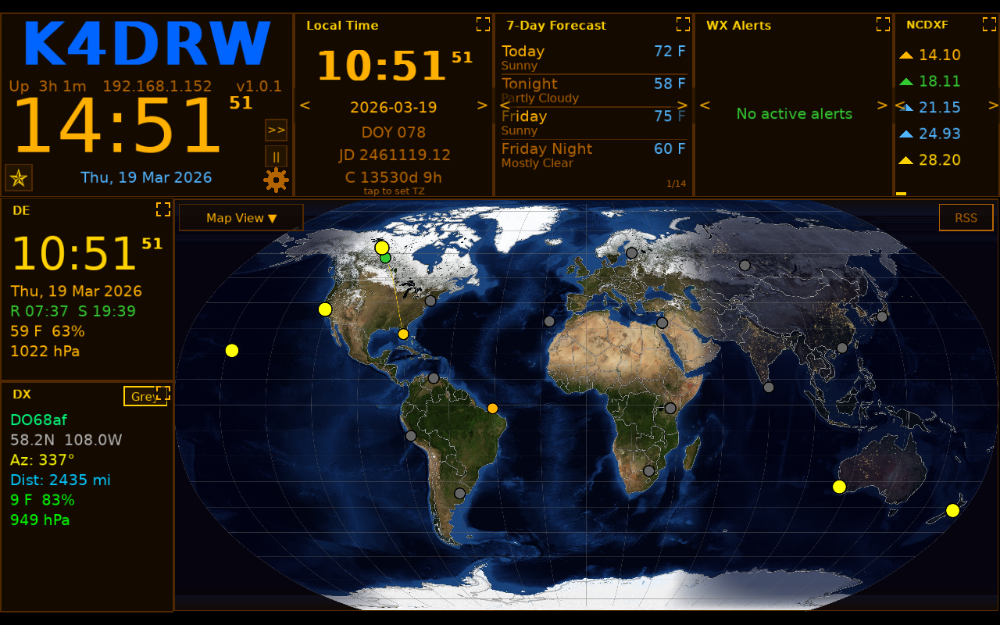
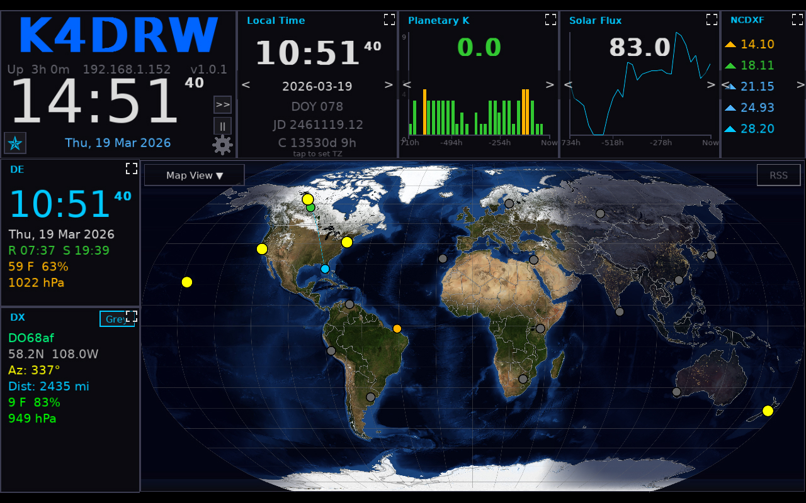
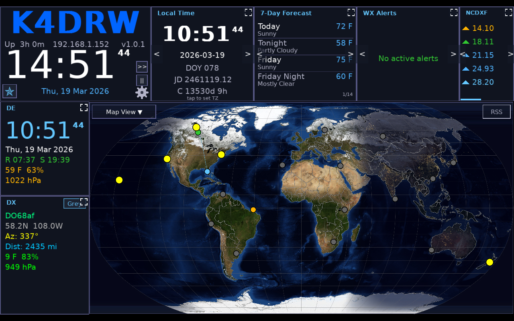
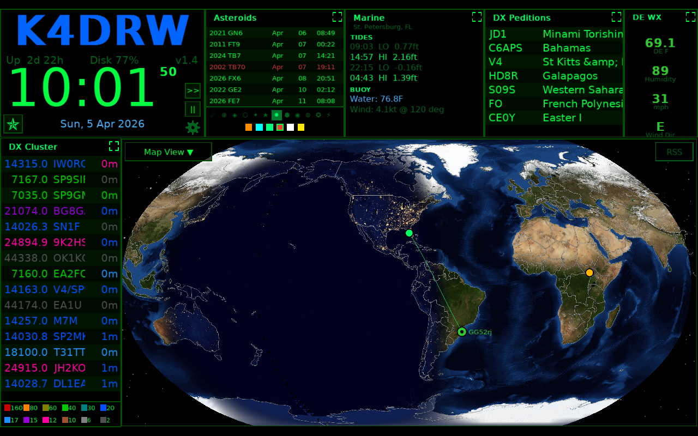
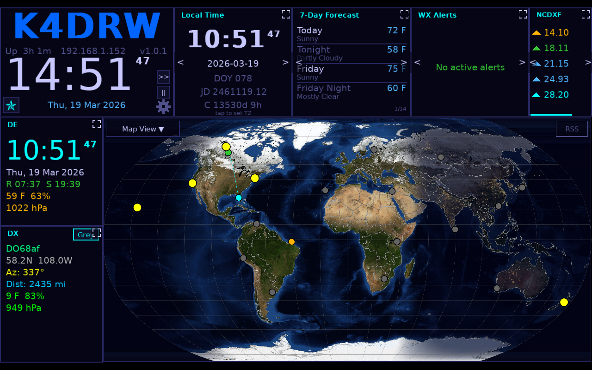
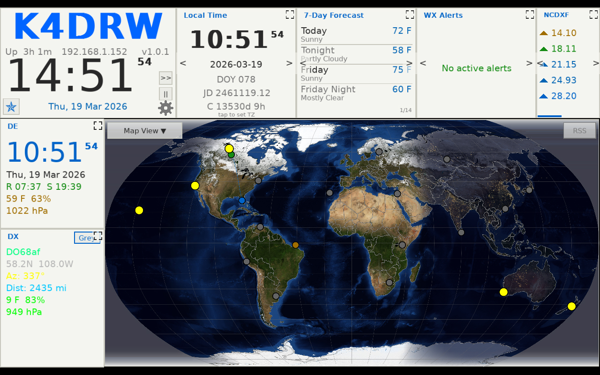

# Map & Overlays

The large center area of HamClock-Next displays an interactive world map with configurable projections and overlays. Map options are controlled from the map settings window.

---

## Map Interaction

### Zoom and Pan

You can move around the map with a mouse or touch screen:
- **Zoom**: Use the mouse wheel to zoom in and out.
- **Pan**: Left-click and drag to move the map while zoomed in.
- **Reset**: Double-right-click anywhere on the map to return to the default view.

### Center the Map on Your Home Location

By default the map is centered on the prime meridian (0° longitude). You can set it to center on your [QTH](Glossary.md#qth) instead. That is especially helpful in Azimuthal view.

Set `mapCenterLon` in [Setup & Configuration](Configuration.md) to your home longitude, for example `-97.0` for central US. The map will keep using that setting after restart.

---

## Map Projections

HamClock-Next supports five map projections:

### Equirectangular

The default projection. Shows the full world with longitude and latitude as straight lines. Easy to read and works well for most purposes.

### Robinson

A compromise projection that balances distortion of area, shape, distance, and direction. Gives a visually pleasing view of the whole world.

### Azimuthal (Great Circle) *(new in HamClock-Next)*

Centered on your [QTH](Glossary.md#qth). Shows true bearing and distance in all directions as straight lines from your station. Useful for antenna pointing. The original HamClock only offered the dual-hemisphere version.

### Mercator

A cylindrical projection that preserves angles and shapes locally. Useful for navigation but significantly distorts area near the poles.

### Dual Azimuthal

Displays two side-by-side azimuthal circles: one centered on your location and one centered on the opposite side of the Earth. Together they show the whole globe with no clipping.

---

## Map Styles

The base map tile style can be changed in [Setup & Configuration](Configuration.md):

| Style       | Description                                   |
| ----------- | --------------------------------------------- |
| `nasa`      | NASA Blue Marble imagery (default)            |
| `terrain`   | Topographic terrain shading                   |
| `countries` | Political country boundaries with fill colors |

---

## Night Shadow (Gray Line)

The night/day terminator (gray line) is always shown on the map, shading the nightside of Earth. This is computed from the current UTC time and astronomical formulas.

---

## Grid Lines

Two grid line types are available (toggle in Configuration):

| Type         | Description                       |
| ------------ | --------------------------------- |
| `latlon`     | Standard latitude/longitude lines |
| `maidenhead` | Maidenhead grid square boundaries |

---

## Propagation Overlays

Propagation overlays shade the map to show HF radio propagation conditions. Only one overlay is active at a time.

Select the active overlay and configure band/mode/power from the Configuration screen or via the map overlay controls.

| Overlay             | Description                                                                                                                     |
| ------------------- | ------------------------------------------------------------------------------------------------------------------------------- |
| **None**            | No propagation overlay                                                                                                          |
| **MUF (Real-time)** | [Maximum Usable Frequency](Glossary.md#muf-maximum-usable-frequency) derived from real-time NOAA ionospheric data — shows areas where the selected band is likely open       |
| **VOACAP Area**     | [VOACAP](Glossary.md#voacap) based propagation reliability prediction from your location to all areas of the map on the selected band                  |
| **VOACAP Point**    | [VOACAP](Glossary.md#voacap) prediction from your location to a specific target point                                                                  |
| **Reliability**     | Circuit reliability percentage map                                                                                              |
| **TOA**             | Take-Off Angle prediction                                                                                                       |
| **Aurora**          | Live aurora oval intensity forecast (NOAA OVATION)                                                                              |
| **Heatmap**         | Live spot density heat map drawn from [PSK Reporter / RBN / WSPR](Glossary.md#psk-reporter--rbn--wspr) data — shows where signals from your area are actually being received right now |
| **DRAP**            | D-Region Absorption Prediction (also available as a widget)                                                                     |

### Propagation Settings

Configure these fields in [Setup & Configuration](Configuration.md):

| Field          | Description                                       |
| -------------- | ------------------------------------------------- |
| `propBand`     | Amateur band to model (e.g., `20m`, `40m`, `10m`) |
| `propMode`     | Emission mode (`SSB`, `CW`, `FT8`, etc.)          |
| `propPower`    | Transmitter power in watts                        |
| `mufRtOpacity` | Opacity of the MUF real-time overlay (0–100)      |

---

## Weather Overlays

Weather overlays can be displayed independently of propagation overlays.

| Overlay          | Description                                                                                                                                                                                                                                                                              |
| ---------------- | ---------------------------------------------------------------------------------------------------------------------------------------------------------------------------------------------------------------------------------------------------------------------------------------- |
| **None**         | No weather overlay                                                                                                                                                                                                                                                                       |
| **Clouds (GFS)** | High-fidelity layered cloud system from NOAA GFS model (GRIB2, 0.25° / 1440x721). Blends Low, Middle, and High altitude data with transparency tuning for realistic depth. Features "Seam Stitching" to ensure gap-free viewing at the Date Line antimeridian in all projections. |
| **WX/Pressure**  | Surface pressure / weather map contours                                                                                                                                                                                                                                                  |

---

## Beacon Markers

When the NCDXF widget is active in any pane, the NCDXF/IBP international beacon network transmitter sites are shown as triangle markers on the map. The currently transmitting beacon is highlighted in bright yellow, while idle beacons are shown in dim gray.

---

## Satellite Ground Tracks

When a satellite is selected and tracking is enabled (`showSatTrack: true`), the satellite's ground track is drawn on the map as an arc showing the upcoming orbital path.

---

## Night Lights

When `mapNightLights` is enabled (default: on), the nightside of the map shows city light imagery from NASA's night lights dataset, overlaid with the night shadow.

---

## Theme Gallery

<!-- BEGIN THEME GALLERY -->
| | |
|---|---|
| **Amber**  | **Dark**  |
| | |
|---|---|
| **Glass**  | **Matrix**  |
| | |
|---|---|
| **Midnight**  | **Paper**  |

<!-- END THEME GALLERY -->
