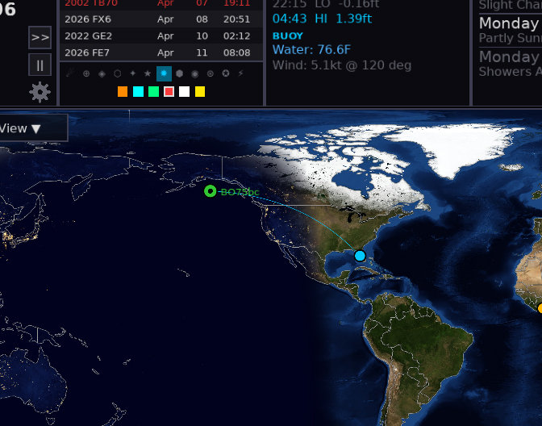

# Configuration Presets

Presets let you save a complete dashboard configuration and recall it instantly with a single click. Use presets to switch between operating modes — for example, a "Contest" preset with different overlays and widget rotations versus an "Evening DX" preset.

---

## Opening the Presets Modal

Click the **star icon (★)** in the Time Panel (top-left corner of the screen) to open the Presets modal.



---

## What a Preset Saves

Each preset captures a complete snapshot of the visual configuration:

| Field | Description |
|-------|-------------|
| Pane 1–6 widget rotations | The full widget rotation list for each pane |
| `rotationIntervalS` | How long each widget is displayed before rotating |
| `propOverlay` | Active propagation overlay (MUF, VOACAP, DRAP, etc.) |
| `weatherOverlay` | Active weather overlay (`none`, `wxmb`, `clouds_grib`) |
| `mapStyle` | Map tile style (nasa, terrain, countries) |
| `mapNightLights` | Night lights on/off |
| `showGrid` | Grid lines on/off |
| `gridType` | Grid type (latlon or maidenhead) |
| `propBand` | Propagation band (e.g., 20m) |
| `propMode` | Propagation mode (e.g., SSB) |
| `propPower` | Transmitter power in watts |

Presets do **not** save identity fields (callsign, grid, lat/lon) or service credentials.

---

## Saving a Preset

1. Configure the dashboard as desired (choose widgets, overlays, map style)
2. Click **★** to open Presets modal
3. Click **Save Current**
4. Enter a name for the preset (e.g., `Contest`, `Evening DX`, `Morning Check`)
5. Click **OK**

The preset appears in the list and is immediately available for recall.

---

## Applying a Preset

1. Click **★** to open Presets modal
2. Scroll to find the desired preset
3. Click the preset row to select it
4. Click **Apply**

HamClock-Next immediately switches all panes, overlays, and map settings to match the preset.

---

## Deleting a Preset

1. Click **★** to open Presets modal
2. Select the preset to delete
3. Click **Delete**

The preset is removed immediately. This action cannot be undone.

---

## Built-in Presets

HamClock-Next ships with one built-in preset that you can apply immediately from the Presets modal:

### Prop Firehose

The **Prop Firehose** preset fills all your panes with propagation and space weather tiles at once. It's the fastest way to turn HamClock-Next into a dedicated propagation monitoring station.

What it loads:
- **Pane 1**: Solar → Solar Storm → Solar Cycle → Ionosonde
- **Pane 2**: Solar Impact Timeline → SFI 30-Day Trend → NOAA Space Wx → Tropo
- **Pane 3**: Aurora → Aurora Graph → VOACAP DE-DX → DRAP
- **Pane 4**: Solar (compact) → Band Conditions → NCDXF Beacons
- **Pane 5**: DE Info
- **Pane 6**: DX Info

Apply it the same way as any other preset: click **★** in the Time Panel → select **Prop Firehose** → click **Apply**.

---

## Presets in Configuration

Presets are stored in the JSON configuration file under the `presets` array:

```json
{
  "presets": [
    {
      "name": "Contest",
      "pane1Rotation": ["SOLAR", "BAND_CONDITIONS"],
      "pane2Rotation": ["DX_CLUSTER"],
      "pane3Rotation": ["LIVE_SPOTS"],
      "pane4Rotation": ["CONTESTS"],
      "pane5Rotation": ["DE_INFO"],
      "pane6Rotation": ["DX_INFO"],
      "rotationIntervalS": 20,
      "propOverlay": "MUF_RT",
      "weatherOverlay": "None",
      "mapStyle": "nasa",
      "mapNightLights": true,
      "showGrid": false,
      "gridType": "latlon",
      "propBand": "20m",
      "propMode": "SSB",
      "propPower": 100
    }
  ]
}
```
