# Widget Gallery

Visual reference for all HamClock-Next widgets. Run `capture_wiki_screenshots.sh` to populate or refresh screenshots.

## All Widgets

| | |
|---|---|
| **ADIF Log** 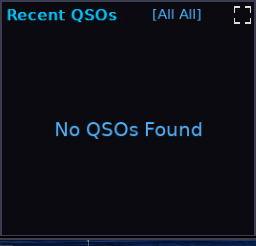 | **Asteroids** 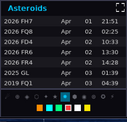 |
| | |
|---|---|
| **Aurora** 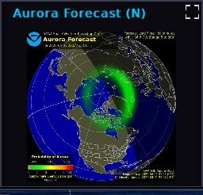 | **Aurora Graph** 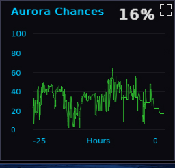 |
| | |
|---|---|
| **Band Cond** 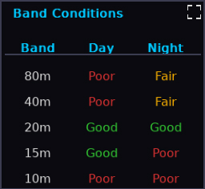 | **Big Clock** 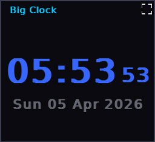 |
| | |
|---|---|
| **Calendar** 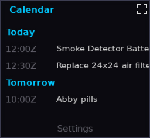 | **Callbook** 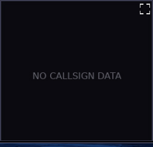 |
| | |
|---|---|
| **Callsign/Clock** 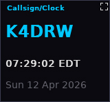 | **Clock Aux** 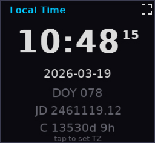 |
| | |
|---|---|
| **Contests** 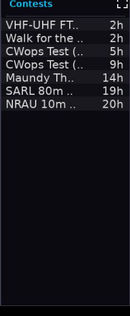 | **Countdown** 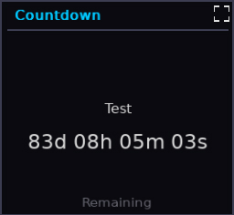 |
| | |
|---|---|
| **DE Info** 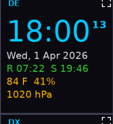 | **DE Weather** 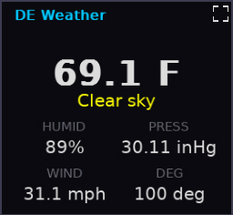 |
| | |
|---|---|
| **DRAP** 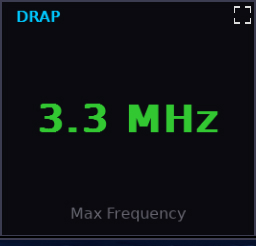 | **Dst Index** 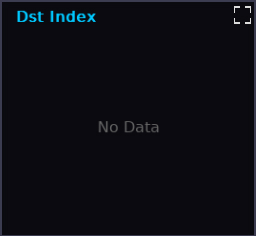 |
| | |
|---|---|
| **DXCC Progress** 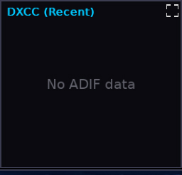 | **DX Cluster** 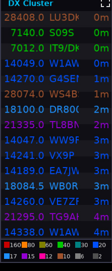 |
| | |
|---|---|
| **DX Info** 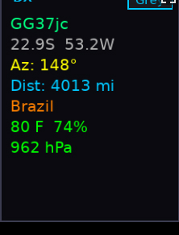 | **DX Peditions** 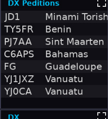 |
| | |
|---|---|
| **DX Weather** 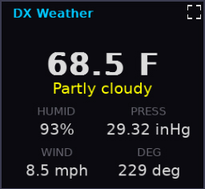 | **EME Tool** 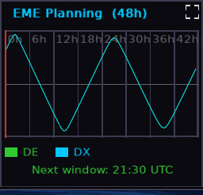 |
| | |
|---|---|
| **ENV Dewpoint** 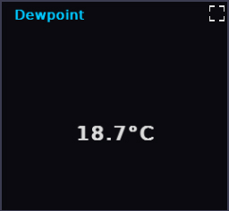 | **ENV Humidity** 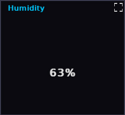 |
| | |
|---|---|
| **ENV Pressure** 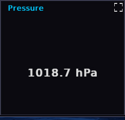 | **ENV Temp** 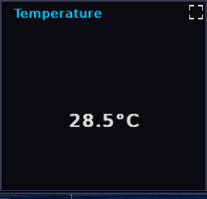 |
| | |
|---|---|
| **Forecast** 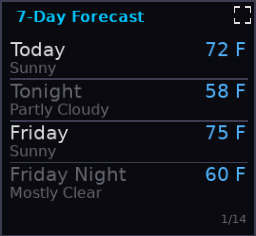 | **Gimbal** 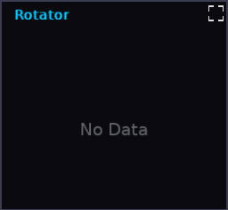 |
| | |
|---|---|
| **Greyline DX** 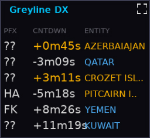 | **Greyline Win.** 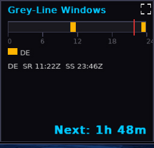 |
| | |
|---|---|
| **Ionosonde** 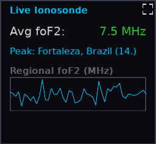 | **K-Index Alert** 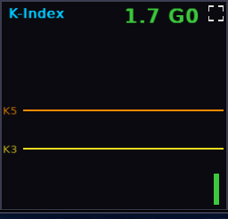 |
| | |
|---|---|
| **K-Index** 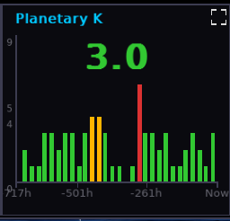 | **Lightning** 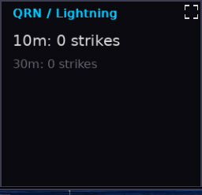 |
| | |
|---|---|
| **Live Spots** 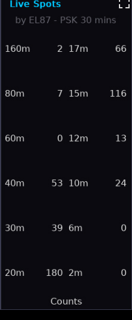 | **Marine** 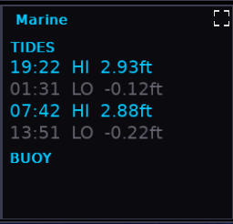 |
| | |
|---|---|
| **Meteor Scatter** 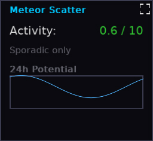 | **Moon** 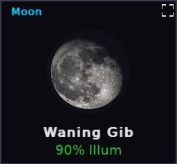 |
| | |
|---|---|
| **NCDXF** 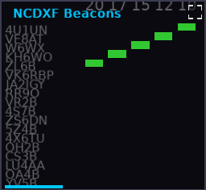 | **NOAA SpaceWx** 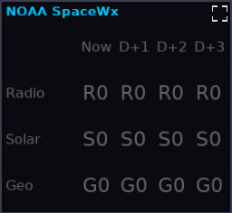 |
| | |
|---|---|
| **On The Air** 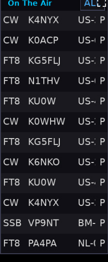 | **Reminders** 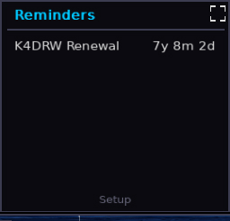 |
| | |
|---|---|
| **Santa Tracker** 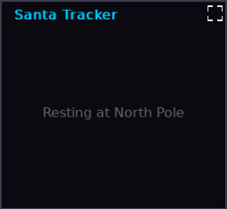 | **Satellite** 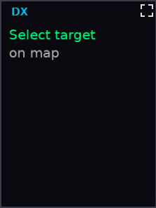 |
| | |
|---|---|
| **SDO** 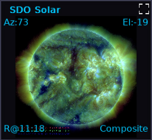 | **SFI 30-Day** 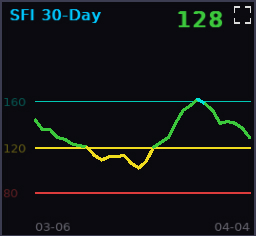 |
| | |
|---|---|
| **Solar Cycle** 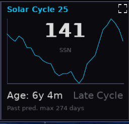 | **Solar Flux** 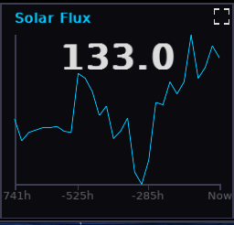 |
| | |
|---|---|
| **Solar Impact** 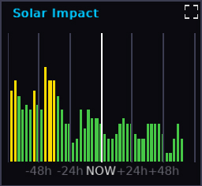 | **Solar** 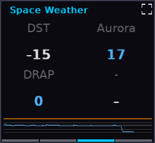 |
| | |
|---|---|
| **Solar Storm**  | **SpaceWx Alerts**  |
| | |
|---|---|
| **Stopwatch**  | **Sunspots**  |
| | |
|---|---|
| **System Info**  | **Tropics**  |
| | |
|---|---|
| **Tropo**  | **Voacap DE-DX**  |
| | |
|---|---|
| **Watchlist**  | **World Clock**  |
| | |
|---|---|
| **WX Alerts**  |  |

## Maximized Widgets

Widgets expanded to fill the map area (via the maximize button on each pane).

| | |
|---|---|
| **Aurora Graph (maximized)**  | **Aurora (maximized)**  |
| | |
|---|---|
| **Band Cond (maximized)**  | **Big Clock (maximized)**  |
| | |
|---|---|
| **DX Cluster (maximized)**  | **Live Spots (maximized)**  |
| | |
|---|---|
| **Solar (maximized)**  |  |

## Fixed UI Elements

| | |
|---|---|
| **Time Panel**  | **RSS Banner**  |
