# Widgets Reference

HamClock-Next includes 44 widgets organized into six categories. Each pane can display any widget or cycle through a list of them.

To add a widget to a pane, click the **top strip** of the pane to open the widget picker.

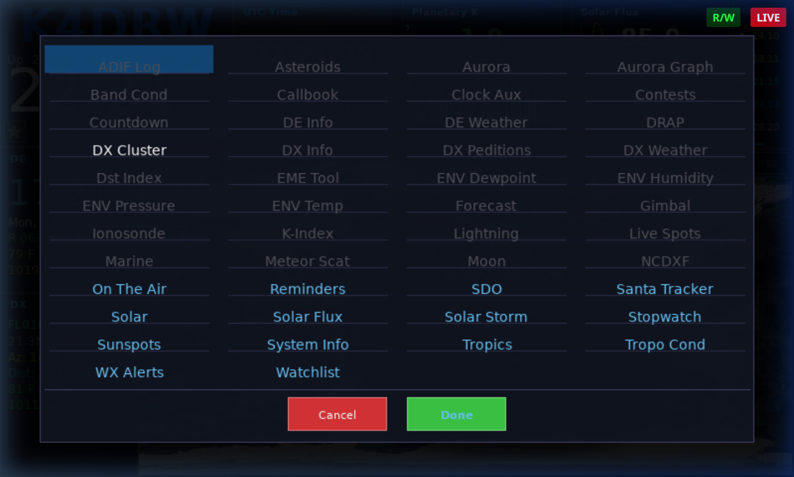

---

## Dashboard Rotation Gallery

Since HamClock-Next allows multiple widgets per pane, the following snapshots show various dashboard configurations as the panes rotate. Use this gallery to see all 44+ widgets in action.

|               Snapshot 1               |               Snapshot 2               |
| :------------------------------------: | :------------------------------------: |
|  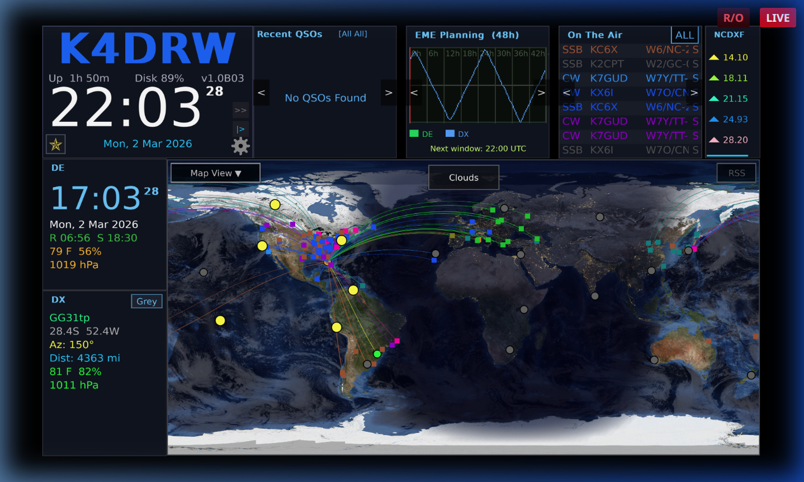  |  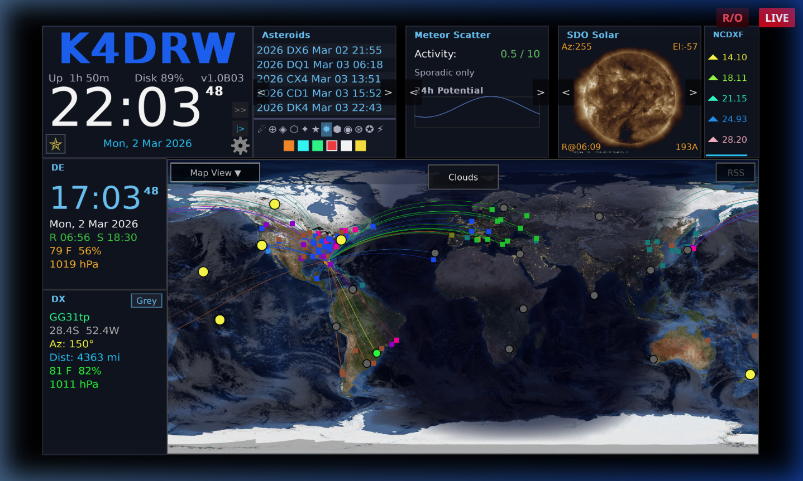  |
|  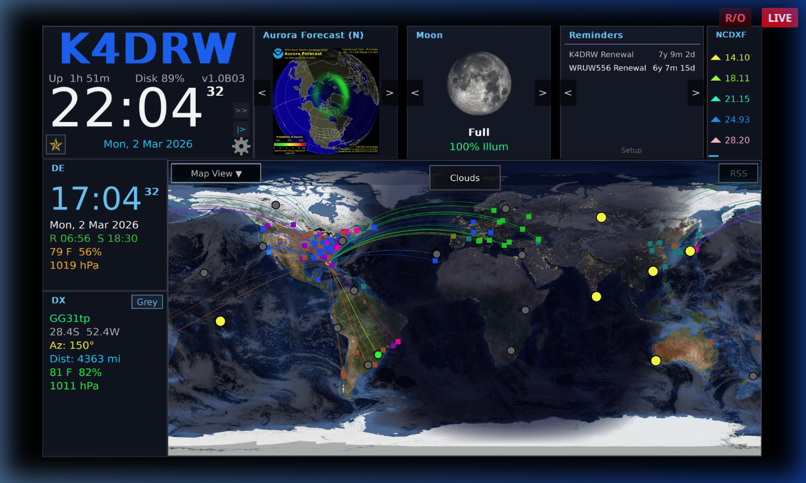  |  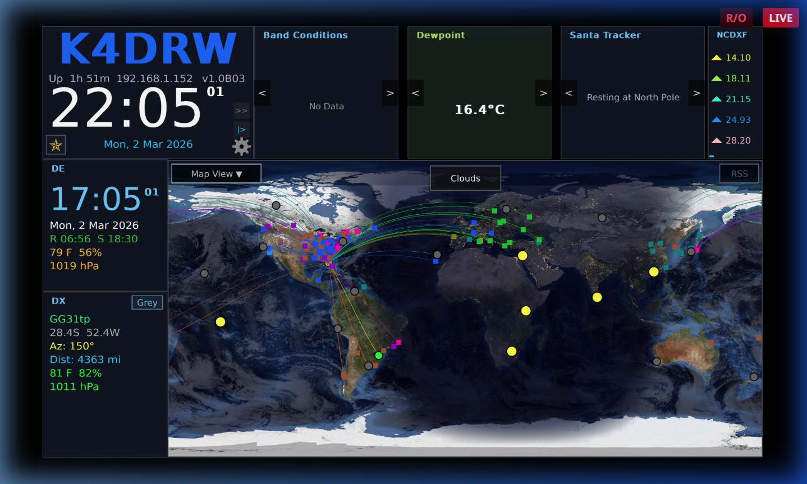  |
|  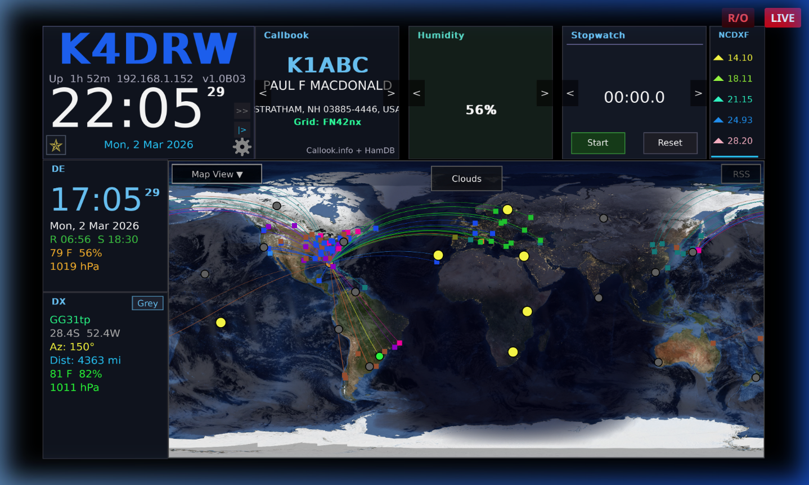  |  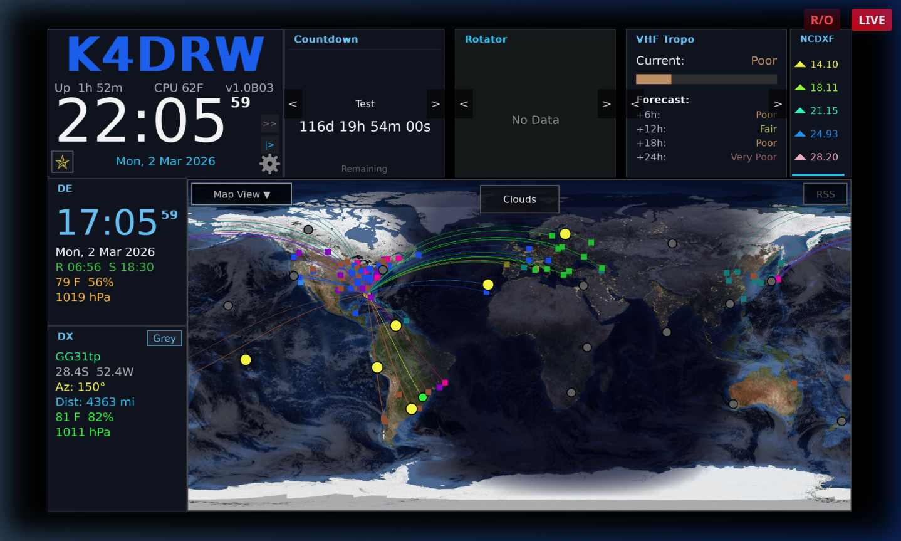  |
|  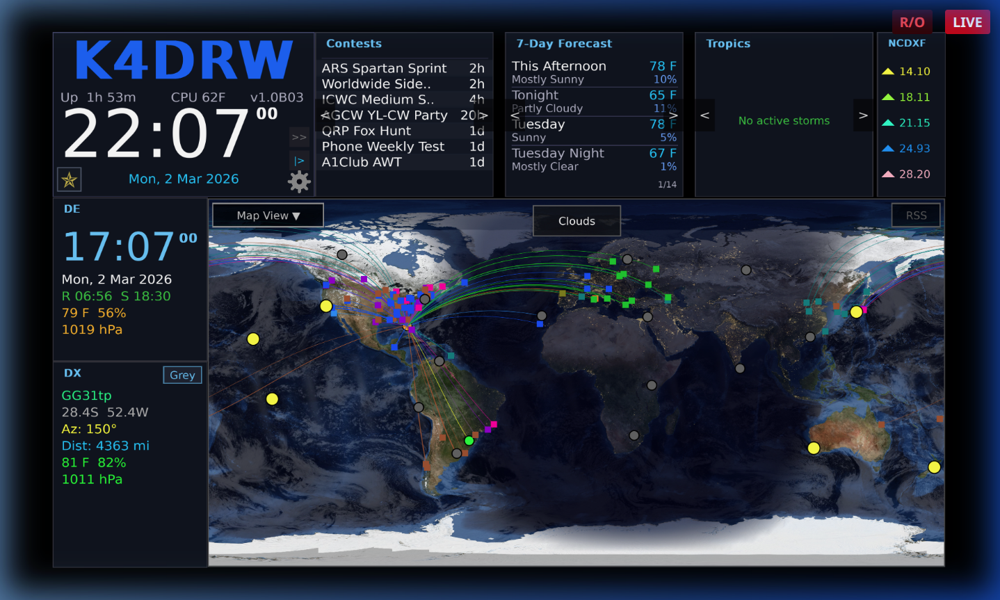  |  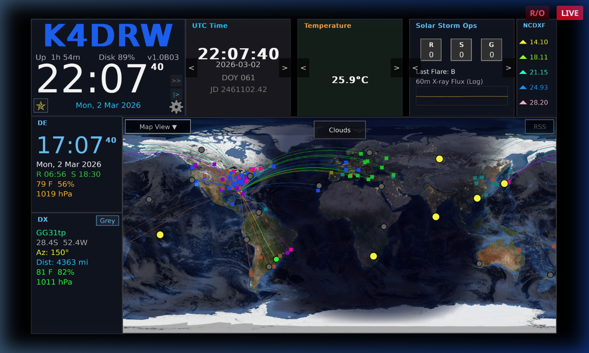  |
|  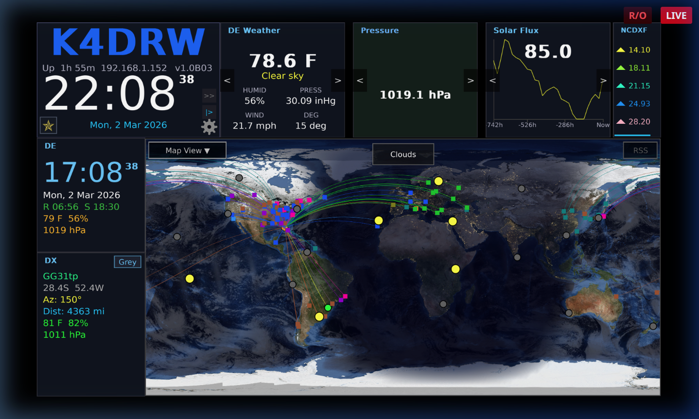  |  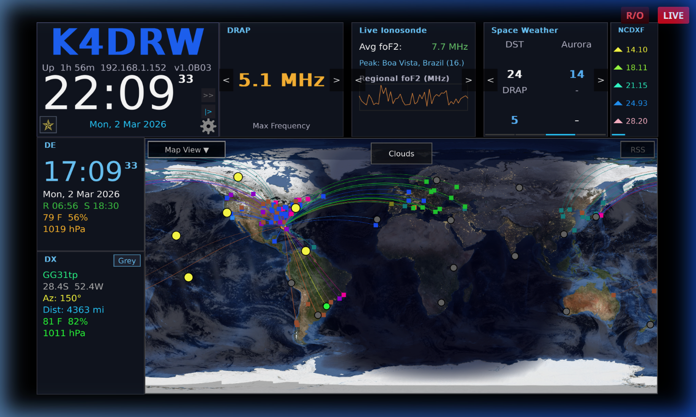  |
| 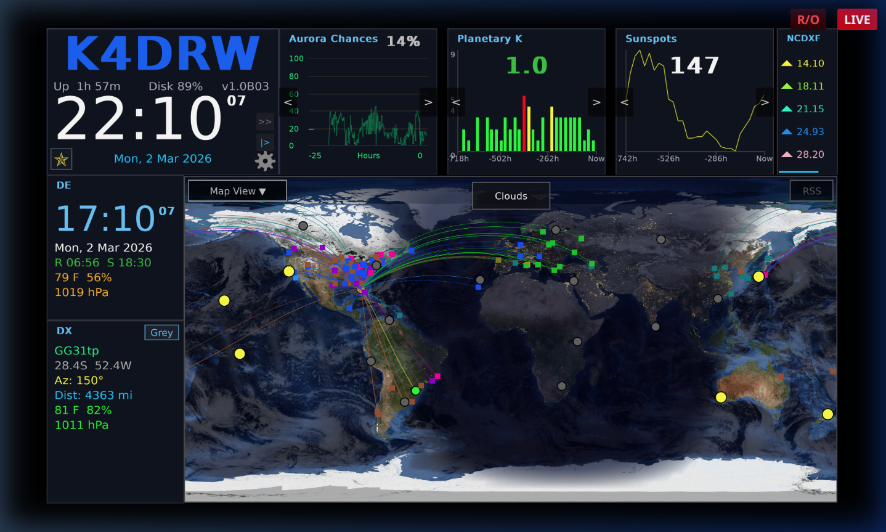 | 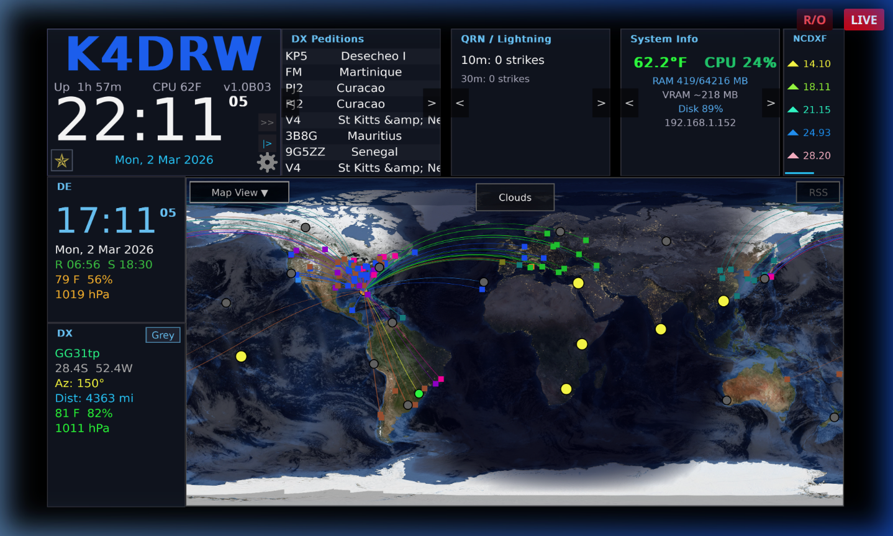 |
| 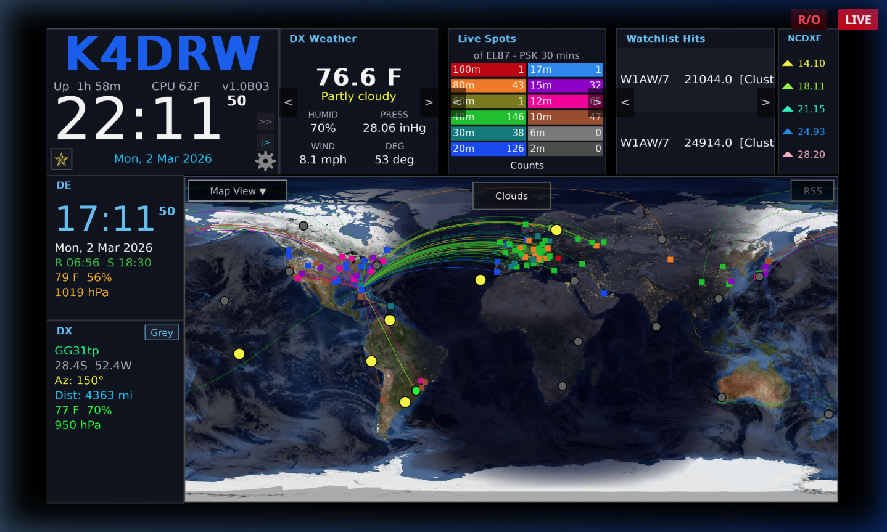 | 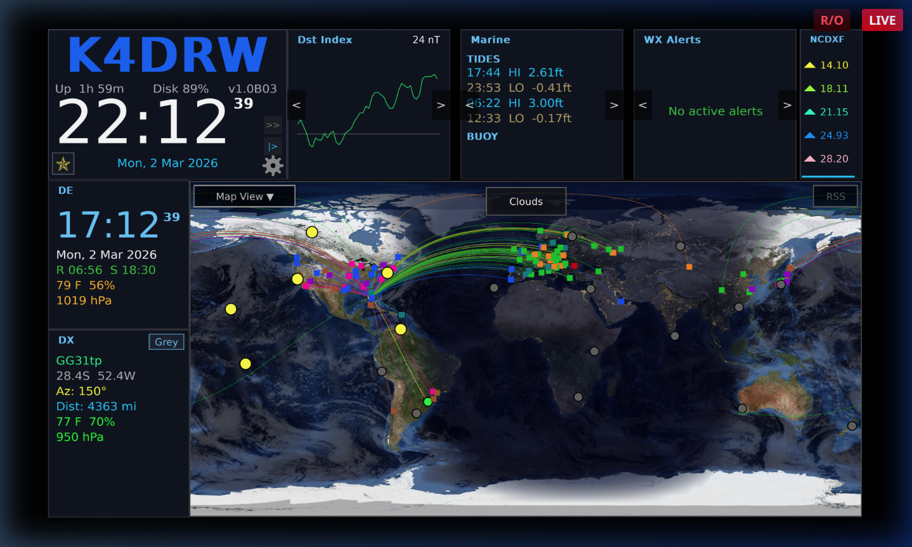 |

---

## Space Weather

| Widget           | Description                                                                                                   | Data Source              |
| ---------------- | ------------------------------------------------------------------------------------------------------------- | ------------------------ |
| **Solar**        | Solar flux index (SFI), sunspot number (SSN), X-ray flux, proton flux, solar wind speed and density, Kp index | NOAA SWPC                |
| **SDO**          | Live solar imagery from the Solar Dynamics Observatory in selectable wavelengths; optional movie loop         | NASA SDO                 |
| **Aurora**       | Global aurora forecast map from the NOAA OVATION model                                                        | NOAA SWPC                |
| **Aurora Graph** | Time-series graph of geomagnetic Kp index and aurora activity                                                 | NOAA SWPC                |
| **DRAP**         | D-Region Absorption Prediction — HF absorption map showing where ionospheric absorption degrades propagation  | NOAA SWPC                |
| **Solar Storm**  | Current geomagnetic storm watch/warning/alert status                                                          | NOAA SWPC                |
| **History Flux** | Historical solar flux (SFI) graph over multiple days                                                          | NOAA SWPC                |
| **History KP**   | Historical Kp geomagnetic index graph                                                                         | NOAA SWPC                |
| **History SSN**  | Historical sunspot number graph                                                                               | NOAA SWPC                |
| **DST Index**    | Disturbance Storm Time index — a measure of geomagnetic storm severity                                        | NOAA SWPC (Kyoto)        |
| **Ionosonde**    | Ionospheric sounding data                                                                                     | Remote ionosonde network |

---

## Propagation

| Widget              | Description                                                                                 | Data Source        |
| ------------------- | ------------------------------------------------------------------------------------------- | ------------------ |
| **Band Conditions** | Color-coded HF band condition summary (160m–10m) by path type                               | NOAA SWPC derived  |
| **Live Spots**      | Real-time decoded signal spots from PSK Reporter or Reverse Beacon Network, plotted by band | PSK Reporter / RBN |
| **NCDXF**           | NCDXF/IBP international beacon schedule and current beacon on air                           | NCDXF              |

---

## DX / Spots

| Widget           | Description                                               | Data Source                       |
| ---------------- | --------------------------------------------------------- | --------------------------------- |
| **DX Cluster**   | Live DX spots from a telnet DX cluster or WSJT-X UDP feed | Configured cluster host or WSJT-X |
| **DX Peditions** | Upcoming and active DXpeditions list                      | ng3k.com                          |
| **On The Air**   | Active POTA and SOTA activations worldwide                | POTA / SOTA APIs                  |
| **ADIF**         | Displays recent QSOs from a local ADIF log file           | Local file                        |
| **Callbook**     | Callsign lookup results (name, QTH, grid)                 | Callook / HamDB / QRZ             |
| **Watchlist**    | Monitor specific callsigns in the DX cluster stream       | DX Cluster (filtered)             |
| **Alerts**       | Triggered alerts based on watchlist or band activity      | Internal                          |

---

## Weather

| Widget         | Description                                                   | Data Source   |
| -------------- | ------------------------------------------------------------- | ------------- |
| **DE Weather** | Current weather conditions at your home location (DE)         | Open-Meteo    |
| **DX Weather** | Current weather conditions at the selected DX entity location | Open-Meteo    |
| **Forecast**   | Multi-day weather forecast for DE location                    | Open-Meteo    |
| **Hurricane**  | Active tropical storm / hurricane tracks                      | NHC / NOAA    |
| **Marine**     | Marine weather and sea state                                  | NOAA marine   |
| **Lightning**  | Real-time lightning strike activity map                       | Blitzortung   |
| **Tropo**      | Tropospheric ducting forecast index                           | APRS / custom |
| **Meteor**     | Meteor scatter activity / upcoming shower calendar            | IMO           |

---

## Tracking

| Widget            | Description                                                                                                                                                   | Data Source                 |
| ----------------- | ------------------------------------------------------------------------------------------------------------------------------------------------------------- | --------------------------- |
| **Moon**          | Moon phase, rise/set times, azimuth/elevation, distance                                                                                                       | Astronomical calculation    |
| **Gimbal**        | Antenna rotator position display (requires Hamlib rotctld)                                                                                                    | Hamlib rotctld              |
| **EME Tool**      | Earth-Moon-Earth (moonbounce) window calculator                                                                                                               | Astronomical calculation    |
| **Santa Tracker** | Tracks Santa's position on Christmas Eve; activates on Dec 24 only (originally a hidden easter egg in the original HamClock — now a proper selectable widget) | Internal calculation        |
| **Asteroid**      | Next 5 close Earth approaches from the Minor Planet Center / JPL                                                                                              | JPL SBDB Close Approach API |

---

## Info / Utilities

| Widget           | Description                                                                                      | Data Source              |
| ---------------- | ------------------------------------------------------------------------------------------------ | ------------------------ |
| **DE Info**      | Your DE location details: callsign, grid, lat/lon, ITU zone, CQ zone, DXCC entity, bearing to DX | Internal config          |
| **DX Info**      | Details on the current DX target entity: name, prefix, zones, bearing/distance from DE           | Internal / DXCC database |
| **Clock Aux**    | Auxiliary analog or digital clock — useful for a second timezone                                 | Internal                 |
| **Countdown**    | Configurable countdown timer to a named event                                                    | Internal                 |
| **Stopwatch**    | Simple stopwatch                                                                                 | Internal                 |
| **Reminder**     | License expiry reminder and configurable date reminders                                          | Internal / FCC database  |
| **Repeater Dir** | Repeater directory lookup for your area (requires API key)                                       | RepeaterBook             |
| **Winlink**      | Winlink gateway listing for your area (requires access)                                          | Winlink API              |
| **Sys Info**     | System information: CPU, memory, network, uptime                                                 | Local OS                 |

---

## Contests

| Widget       | Description                                | Data Source          |
| ------------ | ------------------------------------------ | -------------------- |
| **Contests** | Upcoming and active amateur radio contests | Contest calendar API |

