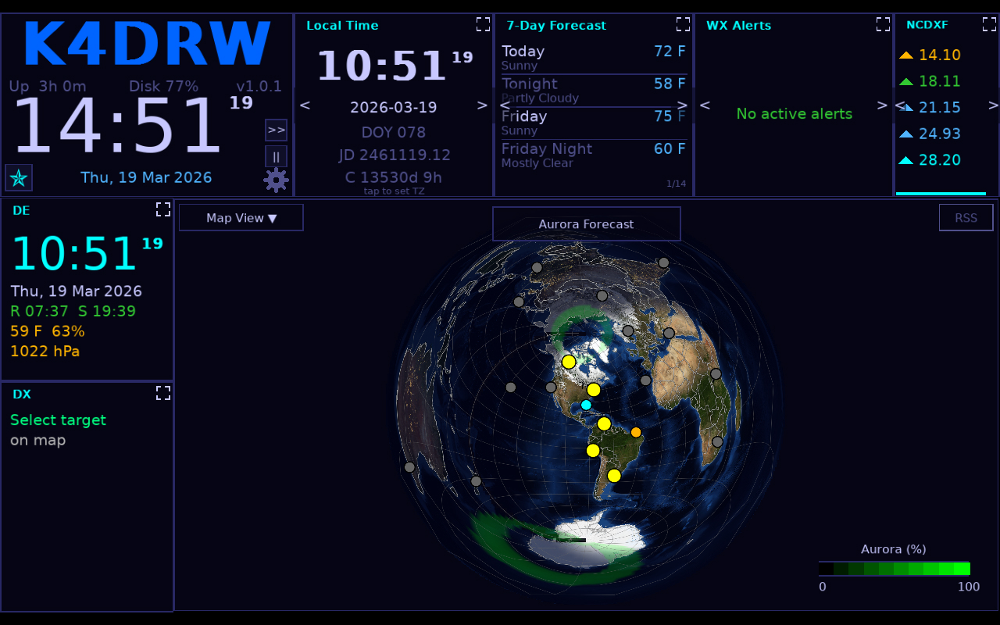
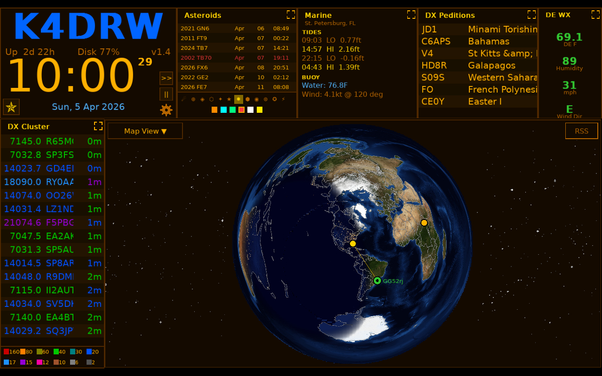
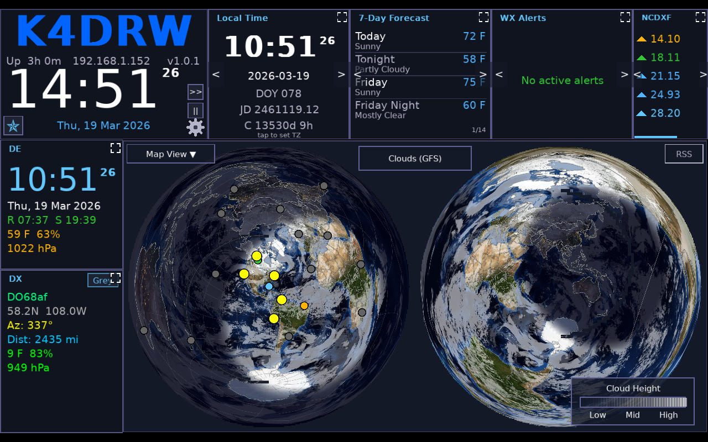
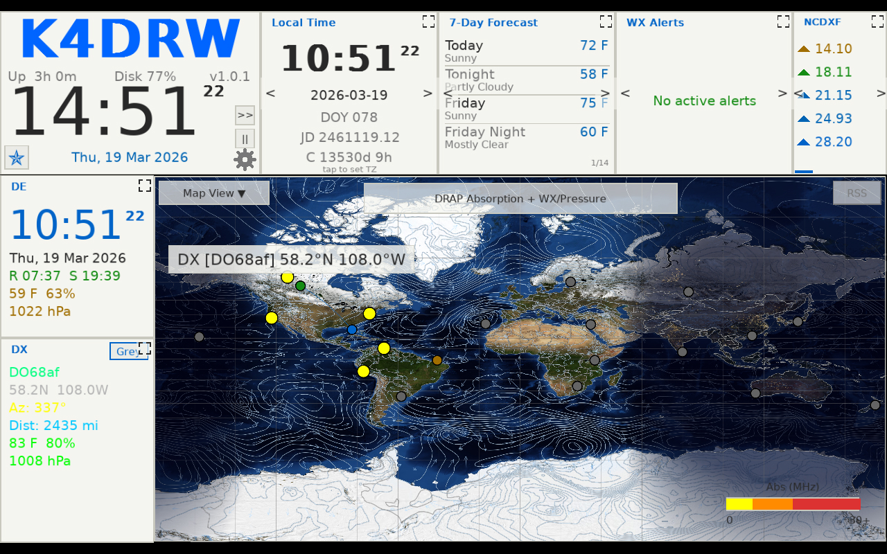
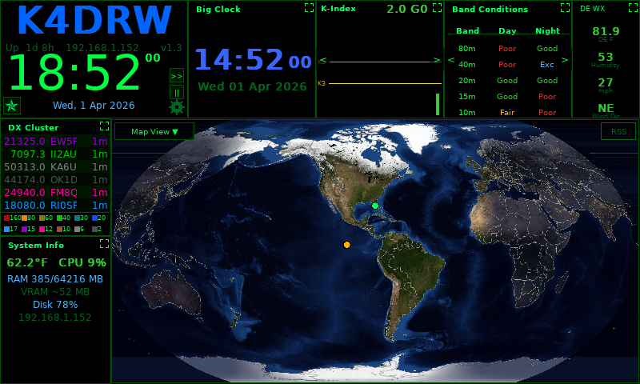
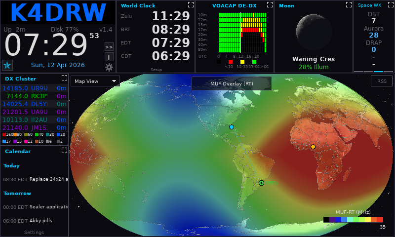
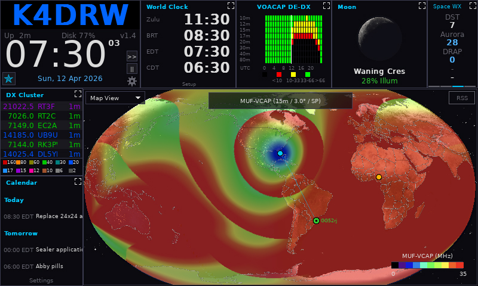

# Widgets Reference

HamClock-Next includes 64 widgets organized into categories. Each pane can display any widget or cycle through a list of them.

To add a widget to a pane, click the **top strip** of the pane to open the widget picker.

---

## Map Looks Gallery

<!-- BEGIN MAP LOOKS -->
| | |
|---|---|
|  |  |
| | |
|---|---|
|  |  |
| | |
|---|---|
|  |  |
| | |
|---|---|
|  |  |

<!-- END MAP LOOKS -->

---

## Space Weather

| Widget           | Description                                                                                                   | Data Source              |
| ---------------- | ------------------------------------------------------------------------------------------------------------- | ------------------------ |
| **Solar**        | Solar flux index (SFI), sunspot number (SSN), X-ray flux, proton flux, solar wind speed and density, Kp index | NOAA SWPC                |
| **SDO**          | Live solar imagery from the Solar Dynamics Observatory in selectable wavelengths; optional movie loop         | NASA SDO                 |
| **Aurora**       | Global aurora forecast map from the NOAA OVATION model                                                        | NOAA SWPC                |
| **Aurora Graph** | Time-series graph of geomagnetic Kp index and aurora activity                                                 | NOAA SWPC                |
| **DRAP**         | D-Region Absorption Prediction — HF absorption map showing where ionospheric absorption degrades propagation  | NOAA SWPC                |
| **Solar Storm**  | Current geomagnetic storm watch/warning/alert status                                                          | NOAA SWPC                |
| **History Flux** | Historical solar flux (SFI) graph over multiple days                                                          | NOAA SWPC                |
| **History KP**   | Historical Kp geomagnetic index graph                                                                         | NOAA SWPC                |
| **History SSN**  | Historical sunspot number graph                                                                               | NOAA SWPC                |
| **DST Index**       | Disturbance Storm Time index — a measure of geomagnetic storm severity                          | NOAA SWPC (Kyoto)        |
| **Ionosonde**       | Ionospheric sounding data (foF2, MUF, hmF2) from a remote ionosonde station                    | Remote ionosonde network |
| **K-Index Alert**   | K-index trend bar chart with configurable alert threshold indicator                             | NOAA SWPC                |
| **SFI 30-Day**      | Solar Flux Index (SFI) 30-day trend bar chart                                                   | NOAA SWPC                |
| **Solar Cycle**     | Current solar cycle progression: predicted vs. observed sunspot numbers                         | NOAA SWPC / SIDC         |
| **Solar Impact**    | Timeline of recent solar events: flares, CMEs, and geomagnetic storm onsets                    | NOAA SWPC                |
| **NOAA SpaceWx**    | NOAA Space Weather forecast text: geomagnetic, solar radiation, and radio blackout conditions   | NOAA SWPC                |
| **SpaceWx Alerts**  | Active NOAA Space Weather watches, warnings, and alerts as a scrollable list                    | NOAA SWPC                |

---

## Propagation

| Widget              | Description                                                                                 | Data Source        |
| ------------------- | ------------------------------------------------------------------------------------------- | ------------------ |
| **Band Conditions** | Color-coded HF band condition summary (160m–10m) by path type                               | NOAA SWPC derived  |
| **Live Spots**      | Real-time decoded signal spots from PSK Reporter or Reverse Beacon Network, plotted by band | PSK Reporter / RBN |
| **NCDXF**           | NCDXF/IBP international beacon schedule and current beacon on air                           | NCDXF              |
| **Voacap DE-DX**    | VOACAP short-path propagation prediction between DE and DX by band and hour                 | VOACAP (local)     |

---

## DX / Spots

| Widget           | Description                                               | Data Source                       |
| ---------------- | --------------------------------------------------------- | --------------------------------- |
| **DX Cluster**   | Live DX spots from a telnet cluster or WSJT-X. Includes mode badges (CW, SSB, etc.) and 'needed' markers (New DXCC or Band). Click a band in the color legend to filter the list. | Configured cluster host or WSJT-X |
| **Greyline DX**  | DXCC entities currently in the greyline, with a live countdown to the peak propagation moment and a color warning as the window narrows | Internal / Astronomical calculation |
| **DX Peditions** | Upcoming and active DXpeditions list                                | ng3k.com                          |
| **On The Air**   | Active POTA and SOTA activations worldwide                | POTA / SOTA APIs                  |
| **ADIF**         | Displays recent QSOs from a local ADIF log file           | Local file                        |
| **Callbook**     | Callsign lookup results (name, QTH, grid)                 | Callook / HamDB / QRZ             |
| **Watchlist**       | Monitor specific callsigns in the DX cluster. Alerts show up even when this tile is hidden. | DX Cluster (filtered)             |
| **Alerts**          | Triggered alerts based on watchlist hits or band activity thresholds             | Internal                          |
| **Greyline Win.**   | Daily greyline opening and closing times for configured DXCC entities            | Astronomical calculation          |
| **DXCC Progress**   | DXCC award progress tracker — worked vs. confirmed entities by band and mode     | Local ADIF log                    |

---

## Weather

| Widget         | Description                                                   | Data Source   |
| -------------- | ------------------------------------------------------------- | ------------- |
| **DE Weather** | Current weather conditions at your home location (DE)         | Open-Meteo    |
| **DX Weather** | Current weather conditions at the selected DX entity location | Open-Meteo    |
| **Forecast**   | Multi-day weather forecast for DE location                    | Open-Meteo    |
| **Hurricane**  | Active tropical storm / hurricane tracks                      | NHC / NOAA    |
| **Marine**     | Marine weather and sea state. Includes a "Find Closest" button in the settings to automatically select the nearest NOAA tide and buoy stations. | NOAA marine   |
| **Lightning**  | Real-time lightning strike activity map                       | Blitzortung   |
| **Tropo**      | Tropospheric ducting forecast index                           | APRS / custom |
| **Meteor**     | Meteor scatter activity / upcoming shower calendar            | IMO           |

---

## Tracking

| Widget            | Description                                                                                                                                                   | Data Source                 |
| ----------------- | ------------------------------------------------------------------------------------------------------------------------------------------------------------- | --------------------------- |
| **Satellite**     | Next-pass predictions for selected satellites with AOS/LOS time and max elevation                                                                             | SGP4 / TLE data             |
| **Moon**          | Moon phase, rise/set times, azimuth/elevation, distance, and EME Doppler shift                                                                                | Astronomical calculation    |
| **Gimbal**        | Antenna rotator position display (requires Hamlib rotctld)                                                                                                    | Hamlib rotctld              |
| **EME Tool**      | Earth-Moon-Earth (moonbounce) window calculator                                                                                                               | Astronomical calculation    |
| **Santa Tracker** | Tracks Santa's position on Christmas Eve; activates on Dec 24 only (originally a hidden easter egg in the original HamClock \u2014 now a proper selectable widget) | Internal calculation        |
| **Asteroid**      | Next 5 close Earth approaches from the Minor Planet Center / JPL                                                                                              | JPL SBDB Close Approach API |

---

## Info / Utilities

| Widget           | Description                                                                                      | Data Source              |
| ---------------- | ------------------------------------------------------------------------------------------------ | ------------------------ |
| **Big Clock**       | Full-pane UTC and local time display in large digits                                             | Internal                 |
| **Callsign/Clock**  | Callsign display with UTC clock — ideal as the primary identification widget                    | Internal                 |
| **Clock Aux**       | Auxiliary digital clock; click to cycle UTC, EST, CST, MST, PST, CET, JST, AEST                | Internal                 |
| **World Clock**     | Up to four configurable world clocks with city labels and UTC offsets                           | Internal                 |
| **Calendar**        | Current month calendar with today highlighted; scrollable by month                              | Internal                 |
| **DE Info**         | Your DE location details: callsign, grid, lat/lon, ITU zone, CQ zone, DXCC entity, bearing to DX | Internal config        |
| **DX Info**         | Details on the current target station: name, prefix, zones, local time, and bearing/distance from your location | Internal / DXCC database |
| **Countdown**       | Configurable countdown timer to a named event                                                   | Internal                 |
| **Stopwatch**       | Simple stopwatch with lap timer                                                                  | Internal                 |
| **Reminder**        | License expiry reminder and configurable date reminders                                         | Internal / FCC database  |
| **Rig Control**     | Displays frequency, mode, and S-meter from a connected transceiver *(requires Hamlib)*          | Hamlib rigctld           |
| **Repeater Dir**    | Repeater directory lookup for your area *(requires API key)*                                    | RepeaterBook             |
| **Winlink**         | Winlink gateway listing for your area *(requires Winlink account)*                              | Winlink API              |
| **Sys Info**        | System information: CPU, memory, GPU VRAM, network stats, uptime                                | Local OS                 |

---

## Environment Sensors

These widgets require a BME280 temperature/pressure/humidity sensor connected via I²C (typical on Raspberry Pi setups).

| Widget            | Description                                                     | Data Source   |
| ----------------- | --------------------------------------------------------------- | ------------- |
| **ENV Temp**      | Local temperature reading from a connected BME280 sensor        | BME280 (I²C)  |
| **ENV Pressure**  | Barometric pressure from a connected BME280 sensor with trend   | BME280 (I²C)  |
| **ENV Humidity**  | Relative humidity from a connected BME280 sensor                | BME280 (I²C)  |
| **ENV Dewpoint**  | Calculated dew point from BME280 temperature and humidity       | BME280 (I²C)  |

---

## Contests

| Widget       | Description                                | Data Source          |
| ------------ | ------------------------------------------ | -------------------- |
| **Contests** | Upcoming and active amateur radio contests | Contest calendar API |

